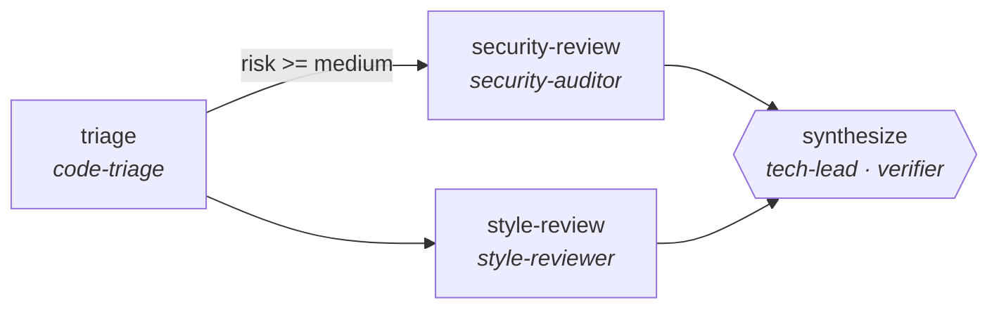
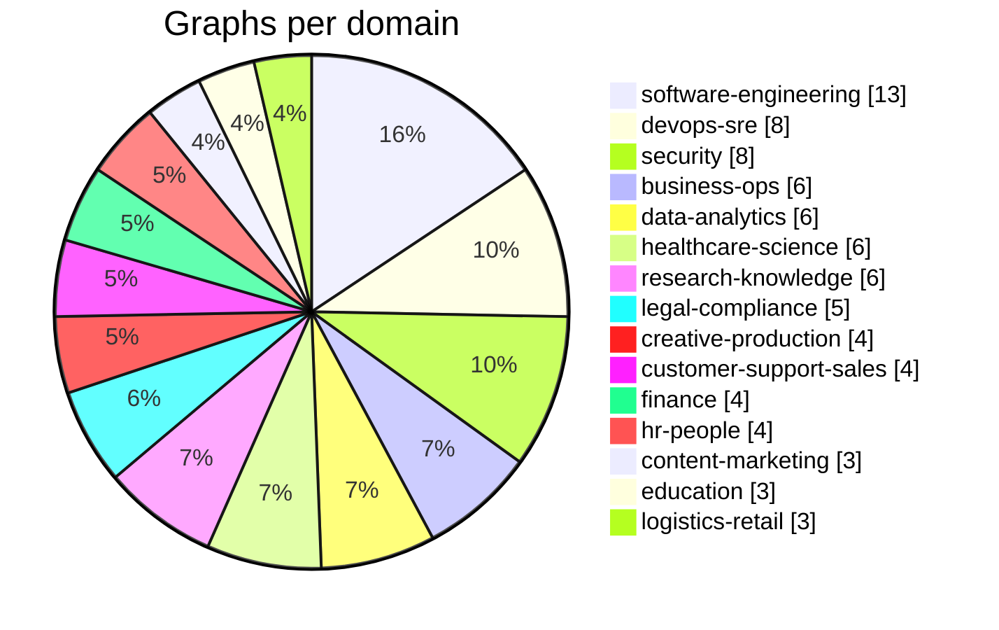

<a id="readme-top"></a>

<div align="center">

[![Graphs][graphs-shield]][graphs-url]
[![Use Cases][usecases-shield]][usecases-url]
[![Domains][domains-shield]][usecases-url]
[![Motifs][patterns-shield]][patterns-url]
[![Tests][tests-shield]][tests-url]
[![MIT License][license-shield]][license-url]

<br />


# 🕸️ agenticgraphs

**Evolvable, quality-proven agentic graphs — for frameworks, developers, and agents themselves.**

*LangGraph gives you a graph engine. CrewAI gives you a team abstraction.*
***Nobody gives you the graphs.*** *This repo is the missing library.*

<br />

[**Explore the graphs »**](graphs/)

[Browse Use Cases](usecases/catalog.yaml) · [Report Bug][issues-url] · [Request Graph][issues-url]

</div>

<details>
  <summary>📖 Table of Contents</summary>
  <ol>
    <li><a href="#-about-the-project">About The Project</a>
      <ul>
        <li><a href="#show-me-a-graph">Show Me a Graph</a></li>
        <li><a href="#built-with">Built With</a></li>
      </ul>
    </li>
    <li><a href="#%EF%B8%8F-the-graph-of-graphs">The Graph of Graphs</a></li>
    <li><a href="#-getting-started">Getting Started</a></li>
    <li><a href="#-usage">Usage</a>
      <ul>
        <li><a href="#concepts">Concepts</a></li>
        <li><a href="#the-nineteen-motifs">The Nineteen Motifs</a></li>
        <li><a href="#what-a-real-model-actually-did">What a Real Model Actually Did</a></li>
        <li><a href="#composites-reference-they-dont-copy">Composites Reference, They Don't Copy</a></li>
        <li><a href="#the-library-at-a-glance">The Library at a Glance</a></li>
      </ul>
    </li>
    <li><a href="#-roadmap">Roadmap</a></li>
    <li><a href="#-for-agents">For Agents</a></li>
    <li><a href="#-contributing">Contributing</a></li>
    <li><a href="#-license">License</a></li>
    <li><a href="#-contact">Contact</a></li>
    <li><a href="#-acknowledgments">Acknowledgments</a></li>
  </ol>
</details>

---

## 🧭 About The Project

A **registry of ready-made multi-agent workflow graphs** in a portable, framework-neutral
format (AGR v1.2), built on three principles:

```yaml
principles:
  - verification_is_structural:   # verifier nodes, termination contracts, and machine-checkable
      enforced_by: the schema     # assertions are REQUIRED by the spec — not by convention
  - quality_is_measured_not_claimed:
      rule: graphs graduate to "shipped" only with an eval profile   # quality, cost, robustness
  - mutation_is_first_class:
      how: nodes declare specialities (roles) requiring abilities (atomic, MCP-bindable
           capabilities) — agents infuse new abilities instead of forking YAML
```

Grounded in research showing graph structure is a *searchable, improvable artifact*:
[GPTSwarm][gptswarm-url] (ICML 2024) treats agent swarms as optimizable graphs;
[AFlow][aflow-url] (ICLR 2025) searches workflow space with MCTS and often lets smaller
models beat larger ones on cost. Our structural lint encodes the [MAST][mast-url]
multi-agent failure taxonomy — dangling edges, unreachable nodes, unbounded loops,
verifier-free termination.

### Show Me a Graph

`graphs/software-engineering/code-review-pipeline/graph.yaml`:



```yaml
apiVersion: agr/v1
name: code-review-pipeline
category: software-engineering
nodes:
  - id: security-review
    speciality: security-auditor            # a role...
    abilities: [read_diff, sast_scan, secret_detection]   # ...with required, bindable abilities
    parallel_group: reviews
  # ...
termination:
  max_steps: 12
  contract: "synthesize emits a verdict in {approve, request_changes} with every finding carrying file+line"
verification:
  - assert: "output.verdict in ['approve','request_changes']"
  - assert: "all(f.file and f.line for f in output.findings)"
```

No prose promises: the contract is part of the artifact, and `agr validate` rejects any graph
whose verifier is missing, whose loop has no exit condition, or whose node claims a speciality
it lacks the abilities for.

### Built With

[![Python][python-badge]][python-url]
[![uv][uv-badge]][uv-url]
[![JSON Schema][jsonschema-badge]][jsonschema-url]
[![YAML][yaml-badge]][yaml-url]
[![pytest][pytest-badge]][pytest-url]

<p align="right">(<a href="#readme-top">back to top</a>)</p>

<!-- graph-of-graphs:begin -->
## 🗺️ The graph of graphs

Every shipped graph is one of nineteen verified motifs. Full per-graph cards (diagram, contract, node roster, use-cases) live in [CARDS.md](CARDS.md).

```mermaid
flowchart TD
    ROOT(("🕸️ agenticgraphs<br/>83 graphs · 15 domains"))
    ROOT --> P0[/"pipeline ×20"/]
    P0 --> E0["e.g. code-review-pipeline"]
    ROOT --> P1[/"map-reduce ×11"/]
    P1 --> E1["e.g. release-notes-generation"]
    ROOT --> P2[/"parallel-swarm ×11"/]
    P2 --> E2["e.g. docs-code-sync-audit"]
    ROOT --> P3[/"router ×9"/]
    P3 --> E3["e.g. incident-triage-router"]
    ROOT --> P4[/"planner-executor-verifier ×6"/]
    P4 --> E4["e.g. bug-triage-and-fix"]
    ROOT --> P5[/"human-gate ×5"/]
    P5 --> E5["e.g. clinical-protocol-lifecycle"]
    ROOT --> P6[/"generator-critic ×5"/]
    P6 --> E6["e.g. test-suite-generation"]
    ROOT --> P7[/"loop ×3"/]
    P7 --> E7["e.g. performance-optimization"]
    ROOT --> P8[/"lifecycle ×3"/]
    P8 --> E8["e.g. feature-delivery-lifecycle"]
    ROOT --> P9[/"reflexion ×2"/]
    P9 --> E9["e.g. flaky-test-reflexion"]
    ROOT --> P10[/"tree-search ×2"/]
    P10 --> E10["e.g. benchmark-driven-optimization-search"]
    ROOT --> P11[/"debate ×1"/]
    P11 --> E11["e.g. ab-test-analysis"]
    ROOT --> P12[/"saga ×1"/]
    P12 --> E12["e.g. schema-migration-saga"]
    ROOT --> P13[/"ensemble-quorum ×1"/]
    P13 --> E13["e.g. differential-diagnosis-ensemble"]
    ROOT --> P14[/"blackboard ×1"/]
    P14 --> E14["e.g. forensic-investigation-blackboard"]
    ROOT --> P15[/"red-team-blue-team ×1"/]
    P15 --> E15["e.g. red-team-blue-team-hardening"]
    ROOT --> P16[/"tournament ×1"/]
    P16 --> E16["e.g. architecture-decision-tournament"]
```



<details><summary>Distribution by domain</summary>



</details>
<!-- graph-of-graphs:end -->

<!-- scoreboard:begin -->
## 📊 Eval scoreboard

83/83 graphs have golden eval cases (139 cases total, 83/83 graphs at 100% pass rate). Regenerate with `uv run python scripts/gen_scoreboard.py`.

**Read the Depth column before the Pass rate column.** A 100% pass rate at `assert-fixture` means the assert held against a mock fixture written alongside the graph — it proves the graph routes the value through, not that the claim was earned. Depth grades, weakest first:

| Depth | What actually happened |
|---|---|
| `describe-only` | prose; nothing machine-checked |
| `assert-fixture` | assert held against a mock fixture — **82 of 83 graphs sit here** |
| `assert-live` | assert held against real model output (`agr eval --live`) |
| `command` | an executable check ran and exited 0 (`agr eval --run-commands`) |

**Real-model evidence:** 5 graphs carry a checked-in recording of an actual model run (`evals/<graph>/live/`), and **4 of 5** satisfy their contract against it. That column is reported separately, never blended into the headline pass rate — a contract a real model cannot satisfy must not be able to hide inside an average. Each cell shows the model and the date it was recorded; ⏳ marks a recording older than 90 days. Re-record with `scripts/record_live.py`.

| Graph | Domain | Cases | Pass rate | Depth | Live (real model) | Mean steps | Routes |
|---|---|---|---|---|---|---|---|
| `invoice-reconciliation` | business-ops | 1 | 100% | `assert-fixture` | — | 4 | 1 |
| `meeting-to-actions` | business-ops | 2 | 100% | `assert-fixture` | ✅ qwen2.5-coder:7b · 2026-08-09 | 4 | 2 |
| `policy-compliance-check` | business-ops | 2 | 100% | `assert-fixture` | — | 4 | 2 |
| `procurement-lifecycle` | business-ops | 1 | 100% | `assert-fixture` | — | 7 | 1 |
| `rfp-response-assembler` | business-ops | 2 | 100% | `assert-fixture` | — | 3 | 1 |
| `vendor-comparison-matrix` | business-ops | 1 | 100% | `assert-fixture` | — | 6 | 1 |
| `blog-production-pipeline` | content-marketing | 2 | 100% | `assert-fixture` | — | 4 | 2 |
| `localization-pipeline` | content-marketing | 2 | 100% | `assert-fixture` | — | 3 | 1 |
| `seo-optimization-loop` | content-marketing | 2 | 100% | `assert-fixture` | — | 4 | 2 |
| `book-editing-pipeline` | creative-production | 1 | 100% | `assert-fixture` | — | 6 | 1 |
| `podcast-production-pipeline` | creative-production | 1 | 100% | `assert-fixture` | — | 5 | 1 |
| `screenplay-coverage` | creative-production | 1 | 100% | `assert-fixture` | — | 6 | 1 |
| `ux-research-synthesis` | creative-production | 2 | 100% | `assert-fixture` | — | 3 | 1 |
| `escalation-summarizer` | customer-support-sales | 2 | 100% | `assert-fixture` | — | 4 | 2 |
| `kb-article-generator` | customer-support-sales | 2 | 100% | `assert-fixture` | ❌ qwen2.5-coder:7b · 2026-08-09 | 4 | 2 |
| `sales-call-scorer` | customer-support-sales | 1 | 100% | `assert-fixture` | — | 3 | 1 |
| `ticket-triage-swarm` | customer-support-sales | 2 | 100% | `assert-fixture` | — | 3 | 2 |
| `ab-test-analysis` | data-analytics | 2 | 100% | `assert-fixture` | — | 3 | 1 |
| `anomaly-investigation` | data-analytics | 2 | 100% | `assert-fixture` | — | 3 | 2 |
| `data-quality-audit` | data-analytics | 2 | 100% | `assert-fixture` | — | 4 | 2 |
| `etl-pipeline-builder` | data-analytics | 2 | 100% | `assert-fixture` | — | 4 | 2 |
| `schema-migration-saga` | data-analytics | 1 | 100% | `assert-fixture` | — | 5 | 1 |
| `sql-generation-verified` | data-analytics | 2 | 100% | `assert-fixture` | — | 4 | 2 |
| `alert-noise-reduction` | devops-sre | 2 | 100% | `assert-fixture` | — | 3 | 1 |
| `deploy-canary-verifier` | devops-sre | 2 | 100% | `assert-fixture` | — | 4 | 2 |
| `incident-lifecycle` | devops-sre | 1 | 100% | `assert-fixture` | — | 10 | 1 |
| `incident-triage-router` | devops-sre | 2 | 100% | `assert-fixture` | — | 3 | 2 |
| `postmortem-writer` | devops-sre | 2 | 100% | `assert-fixture` | — | 4 | 2 |
| `runbook-executor` | devops-sre | 2 | 100% | `assert-fixture` | — | 4 | 2 |
| `self-healing-ci` | devops-sre | 1 | 100% | `assert-fixture` | — | 4 | 1 |
| `verifier-swarm` | devops-sre | 3 | 100% | `command` | — | 5 | 3 |
| `essay-feedback-critic` | education | 2 | 100% | `assert-fixture` | ✅ qwen2.5-coder:7b · 2026-08-09 | 4 | 2 |
| `quiz-generation-verified` | education | 2 | 100% | `assert-fixture` | ✅ qwen2.5-coder:7b · 2026-08-09 | 4 | 2 |
| `rubric-grading-swarm` | education | 2 | 100% | `assert-fixture` | — | 4 | 2 |
| `earnings-call-digest` | finance | 2 | 100% | `assert-fixture` | — | 4 | 2 |
| `expense-audit-swarm` | finance | 2 | 100% | `assert-fixture` | — | 4 | 2 |
| `kyc-document-processing` | finance | 2 | 100% | `assert-fixture` | — | 4 | 2 |
| `regulatory-filing-lifecycle` | finance | 1 | 100% | `assert-fixture` | — | 5 | 1 |
| `adverse-event-scanner` | healthcare-science | 2 | 100% | `assert-fixture` | — | 3 | 1 |
| `clinical-literature-triage` | healthcare-science | 2 | 100% | `assert-fixture` | — | 3 | 2 |
| `clinical-protocol-lifecycle` | healthcare-science | 1 | 100% | `assert-fixture` | — | 4 | 1 |
| `differential-diagnosis-ensemble` | healthcare-science | 1 | 100% | `assert-fixture` | — | 3 | 1 |
| `medical-coding-audit` | healthcare-science | 2 | 100% | `assert-fixture` | — | 4 | 2 |
| `trial-eligibility-screener` | healthcare-science | 1 | 100% | `assert-fixture` | — | 3 | 1 |
| `hiring-lifecycle` | hr-people | 1 | 100% | `assert-fixture` | — | 7 | 1 |
| `jd-drafting-critic` | hr-people | 2 | 100% | `assert-fixture` | ✅ qwen2.5-coder:7b · 2026-08-09 | 4 | 2 |
| `onboarding-plan-builder` | hr-people | 1 | 100% | `assert-fixture` | — | 4 | 1 |
| `performance-cycle-summarizer` | hr-people | 1 | 100% | `assert-fixture` | — | 4 | 1 |
| `contract-lifecycle` | legal-compliance | 1 | 100% | `assert-fixture` | — | 7 | 1 |
| `contract-redline-pipeline` | legal-compliance | 2 | 100% | `assert-fixture` | — | 4 | 2 |
| `ediscovery-triage` | legal-compliance | 2 | 100% | `assert-fixture` | — | 3 | 2 |
| `gdpr-data-audit` | legal-compliance | 1 | 100% | `assert-fixture` | — | 7 | 1 |
| `license-compliance-scan` | legal-compliance | 2 | 100% | `assert-fixture` | — | 3 | 1 |
| `product-listing-pipeline` | logistics-retail | 1 | 100% | `assert-fixture` | — | 7 | 1 |
| `returns-triage` | logistics-retail | 2 | 100% | `assert-fixture` | — | 3 | 2 |
| `supplier-risk-monitor` | logistics-retail | 1 | 100% | `assert-fixture` | — | 6 | 1 |
| `citation-integrity-audit` | research-knowledge | 2 | 100% | `assert-fixture` | — | 4 | 2 |
| `competitive-intelligence` | research-knowledge | 2 | 100% | `assert-fixture` | — | 3 | 1 |
| `cost-routed-research` | research-knowledge | 3 | 100% | `assert-fixture` | — | 3.33 | 3 |
| `fact-check-pipeline` | research-knowledge | 2 | 100% | `assert-fixture` | — | 4 | 2 |
| `literature-review-swarm` | research-knowledge | 2 | 100% | `assert-fixture` | — | 4 | 2 |
| `prompt-graph-optimization` | research-knowledge | 1 | 100% | `assert-fixture` | — | 3 | 1 |
| `compliance-evidence-collector` | security | 1 | 100% | `assert-fixture` | — | 11 | 1 |
| `forensic-investigation-blackboard` | security | 1 | 100% | `assert-fixture` | — | 3 | 1 |
| `phishing-triage` | security | 2 | 100% | `assert-fixture` | — | 3 | 2 |
| `red-team-blue-team-hardening` | security | 1 | 100% | `assert-fixture` | — | 4 | 1 |
| `soc-alert-investigation` | security | 2 | 100% | `assert-fixture` | — | 4 | 2 |
| `threat-intel-digest` | security | 2 | 100% | `assert-fixture` | — | 3 | 1 |
| `vuln-prioritization` | security | 2 | 100% | `assert-fixture` | — | 4 | 2 |
| `vuln-remediation-lifecycle` | security | 1 | 100% | `assert-fixture` | — | 9 | 1 |
| `architecture-decision-tournament` | software-engineering | 1 | 100% | `assert-fixture` | — | 3 | 1 |
| `benchmark-driven-optimization-search` | software-engineering | 1 | 100% | `assert-fixture` | — | 3 | 1 |
| `bug-triage-and-fix` | software-engineering | 2 | 100% | `assert-fixture` | — | 4 | 2 |
| `code-review-pipeline` | software-engineering | 2 | 100% | `assert-fixture` | — | 3.5 | 2 |
| `dependency-upgrade` | software-engineering | 2 | 100% | `assert-fixture` | — | 4 | 2 |
| `docs-code-sync-audit` | software-engineering | 2 | 100% | `assert-fixture` | — | 4 | 2 |
| `feature-delivery-lifecycle` | software-engineering | 3 | 100% | `assert-fixture` | — | 16 | 3 |
| `flaky-test-reflexion` | software-engineering | 1 | 100% | `assert-fixture` | — | 4 | 1 |
| `framework-migration` | software-engineering | 1 | 100% | `assert-fixture` | — | 7 | 1 |
| `legacy-refactor` | software-engineering | 2 | 100% | `assert-fixture` | — | 4 | 2 |
| `performance-optimization` | software-engineering | 2 | 100% | `assert-fixture` | — | 4 | 2 |
| `release-notes-generation` | software-engineering | 2 | 100% | `assert-fixture` | — | 3 | 1 |
| `test-suite-generation` | software-engineering | 2 | 100% | `assert-fixture` | — | 4 | 2 |
<!-- scoreboard:end -->

## 🚀 Getting Started

### Prerequisites

* Python ≥ 3.10
* [uv][uv-url]
  ```sh
  curl -LsSf https://astral.sh/uv/install.sh | sh
  ```

### Installation

**Use it** — the registry ships inside the package, so there's nothing to clone:

```sh
uvx --from "vitruvian-graphs[mcp]" agr list     # 52 graphs, zero setup
pip install "vitruvian-graphs[mcp]"             # or install it properly
```

> Installed as **`vitruvian-graphs`**, imported as **`agenticgraphs`** — PyPI rejects the
> latter as too similar to an unrelated `agentic-graphs` project. The `agr` CLI, the import
> name, and every command in this README are unaffected.

**Hack on it** — clone for the full repo (tests, scripts, generated docs):

1. Clone the repo
   ```sh
   git clone https://github.com/ypollak2/agenticgraphs.git && cd agenticgraphs
   ```
2. Install dependencies
   ```sh
   uv sync
   ```
3. Verify everything
   ```sh
   uv run agr validate && uv run pytest -q
   ```

<p align="right">(<a href="#readme-top">back to top</a>)</p>

## 🧰 Usage

```sh
uv run agr list                # browse all 52 graphs
uv run agr search triage      # find graphs by keyword
uv run agr validate           # full registry: JSON Schema + MAST structural lint
uv run agr show verifier-swarm       # full graph definition
uv run agr mermaid cost-routed-research   # ready-to-paste mermaid diagram
uv run agr profile verifier-swarm    # structural profile (deterministic facts, not perf)
uv run agr eval verifier-swarm       # M1: run golden cases, write profile.json
uv run agr infuse code-review-pipeline style-review classify_risk   # M2: gate-checked mutation
uv run agr optimize verifier-swarm --apply   # M2: measurement-driven structural optimizer
uv run agr adapt cost-routed-research        # M3: compile to runnable LangGraph source
uv run agr adapt cost-routed-research --target crewai    # M3: compile to CrewAI source
uv run agr adapt cost-routed-research --target autogen   # M3: compile to AutoGen source
uv run agr compose incident-triage-router ticket-triage-swarm   # M4: sequentially chain two graphs
uv run agr mcp                       # M3: serve the registry to agents over MCP stdio
```

`agr profile` reports topology, loop-boundedness, verification-assert count, and the graph's
**risk surface** (highest ability risk it can exercise: `read` < `write` < `execute`). Its
`measured` field stays `null` until the M1 eval harness earns real numbers — no fake metrics.

### Compose

`agr compose <graph-a> <graph-b>` bolts B onto the end of A: A's terminal node(s) get an
unconditional edge into B's entry node(s), colliding node ids are namespaced (`a-`/`b-`,
only where they actually collide), and the two termination contracts + verification blocks
are merged. Before wiring anything, it checks that B's entry-level `when` conditions don't
need blackboard keys A never produces (inferred from A's own edge vocabulary and assert
strings) — a mismatch fails closed with the missing keys named, unless you pass
`--allow-gaps` to proceed with a warning. The output always re-validates against the schema
and the MAST lint before it's printed, so a composed graph is exactly as trustworthy as a
hand-written one. Use `-o out.yaml` to write the result instead of printing it, and `--name`
to override the default `<a>-then-<b>` name.

### Adapters

`agr adapt <graph> --target {langgraph,crewai,autogen}` compiles a graph to runnable-shaped
source for a specific framework (`langgraph` is the default). CrewAI nodes become `Agent`s
(speciality → role, abilities → a tools TODO) and edges become sequential `Task`s, with the
termination contract as the terminal task's `expected_output`. AutoGen nodes become
`AssistantAgent`/`ConversableAgent`s in a `GroupChat`, with router `when` conditions compiled
into a `_select_speaker` function and the termination contract wired into
`is_termination_msg`. Both targets are generated code, not runtime dependencies — no crewai
or autogen package is required to run `agr adapt` itself, only to run what it emits.

Every number in this README is checkable:

```sh
uv run agr list | wc -l                      # 52 graphs
uv run python scripts/audit_usecases.py      # 112 use cases, 15 domains, AUDIT PASSED
```

### Concepts

| Concept | Lives in | What it is |
|---|---|---|
| **Graph** | `graphs/<domain>/<name>/graph.yaml` | Nodes + edges + termination contract + verification asserts |
| **Speciality** | `specialities/*.yaml` | A role a node plays (e.g. `security-auditor`), with required abilities |
| **Ability** | `abilities/*.yaml` | An atomic capability (e.g. `sast_scan`) with a risk level; MCP-bindable |
| **Use case** | `usecases/catalog.yaml` | Demand-side backlog: 123 audited entries that graduate into graphs |
| **Spec** | `spec/*.schema.json` | AGR v1.2 JSON Schemas ([v1.1](docs/agr-v1.1.md) · [v1.2](docs/agr-v1.2.md)) |
| **Subgraph** | `nodes[].kind: subgraph` + `ref` | A phase that *is* another registry graph, inlined at load (v1.1) |
| **Join** | `nodes[].join` | `any` (default) · `all` · `quorum(n)` — when a multi-predecessor node is ready (v1.1) |
| **Human gate** | `nodes[].kind: human` + `approval` | An approval contract the live runner refuses to sign itself (v1.1) |
| **Compensation** | `edges[].kind: compensate` | The undo path for a step that writes; lint-required in a saga (v1.1) |

### The Nineteen Motifs

The library is two-tier. **Primitives** are the smallest useful units of agentic
control flow — 2–4 nodes, one concern each. **Composites** (AGR v1.1) assemble
primitives into multi-phase workflows, referencing them rather than restating them.

**Primitives** — the component library (52 graphs, mean 3.2 nodes):

| Motif | Shape | Canonical example |
|---|---|---|
| `pipeline` | staged hand-offs with a reviewing verifier | `contract-redline-pipeline` |
| `parallel-swarm` | planner fans out isolated workers; verifier gates merge | `verifier-swarm` |
| `router` | dispatcher sends work down the cheapest capable branch | `incident-triage-router` |
| `generator-critic` | producer/critic loop; critic can reject N times | `quiz-generation-verified` |
| `debate` | opposing advocates, judge synthesizes | `ab-test-analysis` |
| `map-reduce` | partition → parallel map → verified reduce | `release-notes-generation` |
| `planner-executor-verifier` | plan, execute with effects, prove post-conditions | `runbook-executor` |
| `loop` | attempt → measure → retry until target or budget | `performance-optimization` |

**Composites** — assembled from the above (22 graphs, mean 6.9 nodes):

| Motif | Shape | Canonical example |
|---|---|---|
| `lifecycle` | N phases, each a motif; phases may reference whole graphs | `feature-delivery-lifecycle` |
| `human-gate` | approval barrier no model may sign; blocks flow until satisfied | `regulatory-filing-lifecycle` |
| `supervisor-hierarchy` | supervisor delegates slices to subordinate graphs | `framework-migration` |
| `saga` | every writing step paired with a compensator | `schema-migration-saga` |
| `escalation-ladder` | cheapest tier first, terminating at a human | `invoice-reconciliation` |

**Deep motifs** (AGR v1.2) — graphs that search or learn rather than follow a path:

| Motif | Shape | Canonical example |
|---|---|---|
| `tree-search` | branch k candidates, score, prune to a beam | `benchmark-driven-optimization-search` |
| `ensemble-quorum` | independent passes vote; dissent reported, ties surfaced | `differential-diagnosis-ensemble` |
| `tournament` | >2 options on one rubric; winner records its margin | `architecture-decision-tournament` |
| `reflexion` | each failed attempt writes a lesson the next one reads | `flaky-test-reflexion` |
| `red-team-blue-team` | attacker and defender alternate until exhaustion | `red-team-blue-team-hardening` |
| `blackboard` | specialists contribute to shared evidence opportunistically | `forensic-investigation-blackboard` |

`tree-search` is **beam search, not MCTS** — no rollout policy and no learned value
function, both of which need a real environment. Bounded by `branch × depth`,
deterministic, and step-capped like everything else.

### What a real model actually did

The most useful thing v1.2 produced is a failure. `assert-live` grading shipped in
v1.1 but nothing could produce it, so every graph sat at `assert-fixture`. v1.2 made
recordings possible and pointed a local `qwen2.5-coder:7b` at five graphs.

**All five failed.** Every one raised `NameError: name 'output' is not defined` — on
the exact key its contract asserts. The cause was not the model. `LLMRunner`'s prompt
had said *"reply with a JSON object of your output keys"* since v1.0 and never said
**which**; v1.1 added declared `outputs` contracts and the live runner never read
them. Worse, declared outputs existed only on composites — all 74 primitives had no
contract for a model to aim at.

After teaching the runner to state the contract, **4 of 5 pass**. The fifth is kept,
failing, because the model returned `output: true` where an object is required.

A registry reporting 74/74 at 100% was, on first contact with a real model, 0/5.
That is why the scoreboard grades depth and reports live results in their own column.

### Composites reference, they don't copy

`feature-delivery-lifecycle` is the whole thesis of v1.1 in one file. Eight phases —
research → plan → implement → test → audit → fix → docs → release — where three of
them are not authored at all:

```yaml
- id: implement
  kind: subgraph
  ref: software-engineering/bug-triage-and-fix
- id: audit
  kind: subgraph
  ref: software-engineering/code-review-pipeline
```

It is 10 authored nodes that execute as 17. Fix a bug in `code-review-pipeline` and
every composite auditing a change gets the fix — which text-splicing can never do.

### The Library at a Glance

**74 graphs** across all 15 domains: software-engineering (10), devops-sre (7),
business-ops / data-analytics / security (6 each), healthcare-science /
legal-compliance / research-knowledge (5 each), creative-production / finance /
hr-people (4 each), content-marketing / customer-support-sales / education /
logistics-retail (3 each).

Behind them, a [123-entry use-case catalog](usecases/catalog.yaml) whose invariants
(≥100 entries, ≥10 domains, unique ids, a verification clause on *every* entry) are
enforced by an executable audit wired into pytest.

**On the eval numbers:** 74/74 graphs pass their golden cases, but 73 of 74 do so at
`assert-fixture` depth — the assert held against a mock written alongside the graph.
That proves the topology routes values correctly; it does not prove a claim was
earned. The scoreboard grades every graph so the weak level is visible rather than
averaged away. Deepening it is the open problem, not a solved one.

<p align="right">(<a href="#readme-top">back to top</a>)</p>

## 🗺️ Roadmap

- [x] **M0** — AGR v1 spec, validator + MAST lint, `agr` CLI, 52 validating graphs, audit-gated 112-entry catalog
- [x] **M1** — eval harness (`agr eval`): real graph interpreter (routers, joins, bounded loops,
      contract asserts) + pluggable runners. Mock-fixture profiles are marked `provisional`;
      set `AGR_LLM_BASE_URL`/`AGR_LLM_MODEL` and pass `--live` for model-quality numbers.
- [x] **M2** — `agr infuse` (ability injection; schema+lint+golden-case gated, lineage-logged)
      and `agr optimize` (v0 deterministic hill-climb: dedupe, sibling parallelization,
      measurement-driven `max_steps` tightening). AFlow-style MCTS search remains open.
- [x] **M3** — LangGraph adapter (`agr adapt`: self-contained codegen, no runtime dependency)
      + MCP server (`agr mcp`): `search_graphs / get_graph / instantiate / infuse_ability`.
- [x] **M4** — `agr adapt --target {crewai,autogen}` (two more self-contained codegen
      targets) and `agr compose` (sequentially chain two graphs, with a heuristic
      contract-compatibility check and `--allow-gaps` escape hatch).
- [x] **M5 / AGR v1.1 — composites.** Depth instead of length: `kind: subgraph`
      (inline expansion, depth-capped, cycle-detected), real `join` semantics with
      dead-branch settlement, executable `kind: human` gates, `error`/`compensate`
      edge kinds, per-node `retries`, declared `inputs`/`outputs` contracts, and
      opt-in verification-command execution. 22 composite graphs across five new
      motifs. The v1 scheduler was replaced wholesale against a
      [trace lock](tests/fixtures/v1_trace_lock.json) proving all 106 pre-existing
      cases execute byte-identically. Plan: [v2-agr-1.1.md](docs/plans/v2-agr-1.1.md) ·
      Audit: [v2-audit.md](docs/plans/v2-audit.md).
- [x] **M6 / AGR v1.2 — depth.** Execution frames (the blackboard gained a history),
      real `fan_out` cardinality with logged truncation, `aggregate` (majority /
      median / union / best), `kind: search` (bounded beam), scoped `memory`,
      enforced `state.schema`, and phase-scoped verification — which closes v1.1's
      deferral so a composite inherits its children's contracts. `ReplayRunner`
      makes `assert-live` reachable in CI from checked-in real-model recordings.
      17 graphs migrated off the decorative `parallel_group` label onto real
      fan-out. Plan: [v3-agr-1.2.md](docs/plans/v3-agr-1.2.md) ·
      Audit: [v3-audit.md](docs/plans/v3-audit.md).
- [ ] **M7 / AGR v1.3 — live.** `triggers`, durable checkpoint/resume, enforced
      budgets, federated supervisor. Turns graphs from functions into services.

**Known limits, stated rather than buried:** the live recordings are one model
(`qwen2.5-coder:7b`), one case per graph — enough to prove the mechanism and surface
the contract bug, not enough to claim anything general about model behaviour. Search
graphs are tested against synthetic gradients, not a real scorer.

Of the 52 primitives, three are handcrafted with domain specialities
(`code-review-pipeline`, `verifier-swarm`, `cost-routed-research`) and the other 49 are
motif-template instantiations carrying real per-use-case contracts. The 22 composites
each declare an explicit phase list and I/O contract; 14 of them reference a primitive
by `ref` rather than restating it.

See [open issues][issues-url] for the full list of proposed graphs and known issues.

<p align="right">(<a href="#readme-top">back to top</a>)</p>

## 🤖 For Agents

You are a target audience of this repo. Run `uv run agr mcp` (install with
`uv sync --all-extras`) and you get four tools over stdio: `search_graphs` (keyword +
structural profile), `get_graph` (full YAML), `instantiate` (runnable LangGraph source),
and `infuse_ability` (a validated mutated copy — persisting is by default left to
`agr infuse` on a human-owned checkout). Each graph's `profile.json` tells you what it's
worth before you spend a token — and whether that number is provisional (mock) or live.

**Unattended operation** — three opt-in ways to run without a human at the keyboard:

- **Always-on MCP service**: `agr mcp --http [--port 8765]` serves over HTTP instead of
  stdio (binds `127.0.0.1` only). `scripts/install_service.sh` installs it as a macOS
  LaunchAgent (`--uninstall` to remove).
- **Headless recipes**: `scripts/headless_run.sh [term] [graph]` drives a non-interactive
  `claude -p` run scoped to `Bash(uv run agr *)` and writes a report to `reports/`.
- **Gated autonomous persist**: set `AGR_AUTONOMOUS=1` and `infuse_ability(persist=true)`
  writes back through the same schema + MAST-lint gate, committed to a dedicated
  `auto/mutations` branch (never `main`, never pushed). `agr optimize --apply` honors the
  same flag (or `--autonomous`) to skip its confirmation prompt. Execute-risk abilities are
  further capped behind `AGR_AUTONOMOUS_ALLOW_EXECUTE=1`. Full detail in
  [`docs/autonomy.md`](docs/autonomy.md).

<p align="right">(<a href="#readme-top">back to top</a>)</p>

## 🤝 Contributing

A graph is accepted when — and only when — the gate passes: schema conformance, MAST lint,
resolvable specialities/abilities, and (post-M1) a measured profile.

1. Fork the project
2. Create your branch (`git checkout -b graph/amazing-workflow`)
3. Add your use case in `scripts/gen_catalog.py` (single source of truth) and regenerate
4. Run the gate (`uv run agr validate && uv run pytest`)
5. Commit (`git commit -m 'Add amazing-workflow graph'`)
6. Push and open a Pull Request

<p align="right">(<a href="#readme-top">back to top</a>)</p>

## 📄 License

Distributed under the MIT License. See [`LICENSE`](LICENSE) for more information.

<p align="right">(<a href="#readme-top">back to top</a>)</p>

## 📫 Contact

Yali Pollak — [@ypollak2](https://github.com/ypollak2)

Project Link: [https://github.com/ypollak2/agenticgraphs][repo-url]

<p align="right">(<a href="#readme-top">back to top</a>)</p>

## 🙏 Acknowledgments

* [GPTSwarm — agents as optimizable graphs (ICML 2024)][gptswarm-url]
* [AFlow — MCTS over workflow space (ICLR 2025)][aflow-url]
* [MAST — multi-agent failure taxonomy][mast-url]
* [Best-README-Template][best-readme-url]

<p align="right">(<a href="#readme-top">back to top</a>)</p>

<!-- MARKDOWN LINKS & IMAGES (reference style, per Best-README-Template) -->
[graphs-shield]: https://img.shields.io/badge/graphs-83-2ea44f?style=for-the-badge
[graphs-url]: graphs/
[usecases-shield]: https://img.shields.io/badge/use--case_catalog-131-2ea44f?style=for-the-badge
[usecases-url]: usecases/catalog.yaml
[domains-shield]: https://img.shields.io/badge/domains-15-2ea44f?style=for-the-badge
[patterns-shield]: https://img.shields.io/badge/motifs-19-2ea44f?style=for-the-badge
[patterns-url]: #the-eight-patterns
[tests-shield]: https://img.shields.io/badge/tests-135%2F135-blue?style=for-the-badge
[tests-url]: tests/
[license-shield]: https://img.shields.io/badge/license-MIT-blue?style=for-the-badge
[license-url]: LICENSE
[issues-url]: https://github.com/ypollak2/agenticgraphs/issues
[repo-url]: https://github.com/ypollak2/agenticgraphs
[gptswarm-url]: https://proceedings.mlr.press/v235/zhuge24a.html
[aflow-url]: https://openreview.net/forum?id=z5uVAKwmjf
[mast-url]: https://arxiv.org/abs/2503.13657
[best-readme-url]: https://github.com/othneildrew/Best-README-Template
[python-badge]: https://img.shields.io/badge/Python_3.10%2B-3776AB?style=for-the-badge&logo=python&logoColor=white
[python-url]: https://www.python.org/
[uv-badge]: https://img.shields.io/badge/uv-DE5FE9?style=for-the-badge&logo=uv&logoColor=white
[uv-url]: https://docs.astral.sh/uv/
[jsonschema-badge]: https://img.shields.io/badge/JSON_Schema_2020--12-000000?style=for-the-badge&logo=json&logoColor=white
[jsonschema-url]: https://json-schema.org/
[yaml-badge]: https://img.shields.io/badge/YAML-CB171E?style=for-the-badge&logo=yaml&logoColor=white
[yaml-url]: https://yaml.org/
[pytest-badge]: https://img.shields.io/badge/pytest-0A9EDC?style=for-the-badge&logo=pytest&logoColor=white
[pytest-url]: https://pytest.org/
