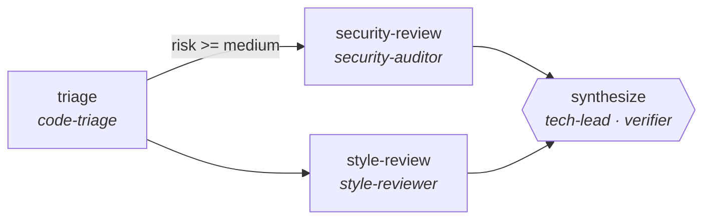

<div align="center">

# agenticgraphs

**Evolvable, quality-proven agentic graphs — for frameworks, developers, and agents themselves.**

[](graphs/)
[](usecases/catalog.yaml)
[](usecases/catalog.yaml)
[](#the-eight-patterns)
[](LICENSE)
[](pyproject.toml)

*LangGraph gives you a graph engine. CrewAI gives you a team abstraction.*
***Nobody gives you the graphs.*** *This repo is the missing library.*

</div>

---

## What is this?

A **registry of ready-made multi-agent workflow graphs** in a portable, framework-neutral
format (AGR v1), built on three principles:

1. **Verification is structural.** Every graph has verifier nodes, a termination contract,
   and machine-checkable assertions — *required by the schema*, not by convention.
2. **Quality is measured, not claimed.** Graphs graduate to "shipped" only with an eval
   profile (quality, cost, robustness, coordination overhead). See [status](#status--roadmap).
3. **Mutation is first-class.** Nodes declare *specialities* (roles) that require *abilities*
   (atomic, MCP-bindable capabilities) — so a running agent can discover a graph, instantiate
   it, and **infuse new abilities into the structure** instead of forking YAML.

Grounded in research showing graph structure is a *searchable, improvable artifact*:
[GPTSwarm](https://proceedings.mlr.press/v235/zhuge24a.html) (ICML 2024) treats agent swarms as
optimizable graphs; [AFlow](https://openreview.net/forum?id=z5uVAKwmjf) (ICLR 2025) searches
workflow space with MCTS and often lets smaller models beat larger ones on cost. Our structural
lint encodes the [MAST](https://arxiv.org/abs/2503.13657) multi-agent failure taxonomy —
dangling edges, unreachable nodes, unbounded loops, verifier-free termination.

## Show me a graph

`graphs/software-engineering/code-review-pipeline/graph.yaml`:



```yaml
apiVersion: agr/v1
name: code-review-pipeline
category: software-engineering
nodes:
  - id: security-review
    speciality: security-auditor            # a role...
    abilities: [read_diff, sast_scan, secret_detection]   # ...with required, bindable abilities
    parallel_group: reviews
  # ...
termination:
  max_steps: 12
  contract: "synthesize emits a verdict in {approve, request_changes} with every finding carrying file+line"
verification:
  - assert: "output.verdict in ['approve','request_changes']"
  - assert: "all(f.file and f.line for f in output.findings)"
```

No prose promises: the contract is part of the artifact, and `agr validate` rejects any graph
whose verifier is missing, whose loop has no exit condition, or whose node claims a speciality
it lacks the abilities for.

## Quickstart

```bash
git clone https://github.com/yalipollak/agenticgraphs && cd agenticgraphs
uv sync

uv run agr list                # browse all 52 graphs
uv run agr search triage       # find graphs by keyword
uv run agr validate            # full registry: JSON Schema + MAST structural lint
uv run pytest -q               # the same gates, CI-style
```

Every number in this README is checkable:

```bash
uv run agr list | wc -l                          # 52 graphs
uv run python scripts/audit_usecases.py          # 112 use cases, 15 domains, AUDIT PASSED
```

## Concepts

| Concept | Lives in | What it is |
|---|---|---|
| **Graph** | `graphs/<domain>/<name>/graph.yaml` | Nodes + edges + termination contract + verification asserts |
| **Speciality** | `specialities/*.yaml` | A role a node plays (e.g. `security-auditor`), with required abilities |
| **Ability** | `abilities/*.yaml` | An atomic capability (e.g. `sast_scan`) with a risk level; MCP-bindable |
| **Use case** | `usecases/catalog.yaml` | Demand-side backlog: 112 audited entries that graduate into graphs |
| **Spec** | `spec/*.schema.json` | AGR v1 JSON Schemas for all of the above |

## The eight patterns

| Pattern | Shape | Canonical example |
|---|---|---|
| `pipeline` | staged hand-offs with a reviewing verifier | `contract-redline-pipeline` |
| `parallel-swarm` | planner fans out isolated workers; verifier gates merge | `verifier-swarm` |
| `router` | dispatcher sends work down the cheapest capable branch | `incident-triage-router` |
| `generator-critic` | producer/critic loop; critic can reject N times | `quiz-generation-verified` |
| `debate` | opposing advocates, judge synthesizes | `ab-test-analysis` |
| `map-reduce` | partition → parallel map → verified reduce | `release-notes-generation` |
| `planner-executor-verifier` | plan, execute with effects, prove post-conditions | `runbook-executor` |
| `loop` | attempt → measure → retry until target or budget | `performance-optimization` |

## The library at a glance

52 graphs across all 15 domains: software-engineering (8), devops-sre (6),
research-knowledge (5), data-analytics (5), security (4), and 3 each for content-marketing,
business-ops, finance, legal-compliance, healthcare-science, education,
customer-support-sales — plus hr-people, logistics-retail, creative-production.
Behind them, a [112-entry use-case catalog](usecases/catalog.yaml) whose invariants
(≥100 entries, ≥10 domains, unique ids, a verification clause on *every* entry) are
enforced by an executable audit wired into pytest.

## Status & roadmap

Honesty over hype — here's exactly where things stand:

| Milestone | State | Meaning |
|---|---|---|
| **M0** — spec, validator, CLI, registry | ✅ done | 52 validating graphs, 20 specialities, 20 abilities, audit-gated catalog |
| **M1** — eval harness, `profile.json` per graph | 🔜 next | until then, graphs are *structurally proven but not performance-measured* |
| **M2** — `mutate/`: infuse abilities, optimize structure (AFlow-style search) | planned | |
| **M3** — adapters (LangGraph first) + MCP server (`search / get / instantiate / infuse_ability`) | planned | agents become first-class consumers |

Three graphs are handcrafted with domain specialities (`code-review-pipeline`,
`verifier-swarm`, `cost-routed-research`); the other 49 are pattern-template instantiations
carrying real per-use-case contracts — deliberately generic until M1 measurement tells us
where specialization pays.

## For agents 🤖

You are a target audience of this repo. Today: clone it, `agr search <task>`, load the YAML,
map abilities onto your tools. After M3: an MCP server exposes the registry so you can discover,
instantiate, and mutate graphs at runtime — with each graph's measured profile telling you what
it's worth before you spend a token.

## Contributing

A graph is accepted when — and only when — `uv run agr validate` and `uv run pytest` pass:
schema conformance, MAST lint, resolvable specialities/abilities, and (post-M1) a measured
profile. Add use cases in `scripts/gen_catalog.py` (single source of truth) and regenerate;
the audit will hold the line.

## License

[MIT](LICENSE) © 2026 Yali Pollak
