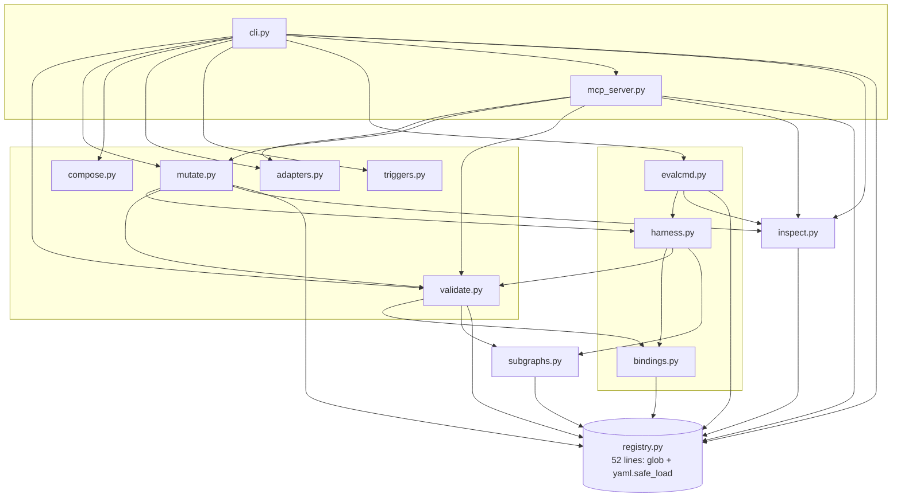
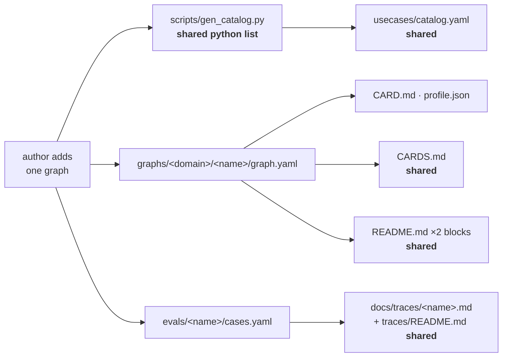
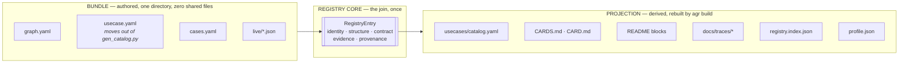
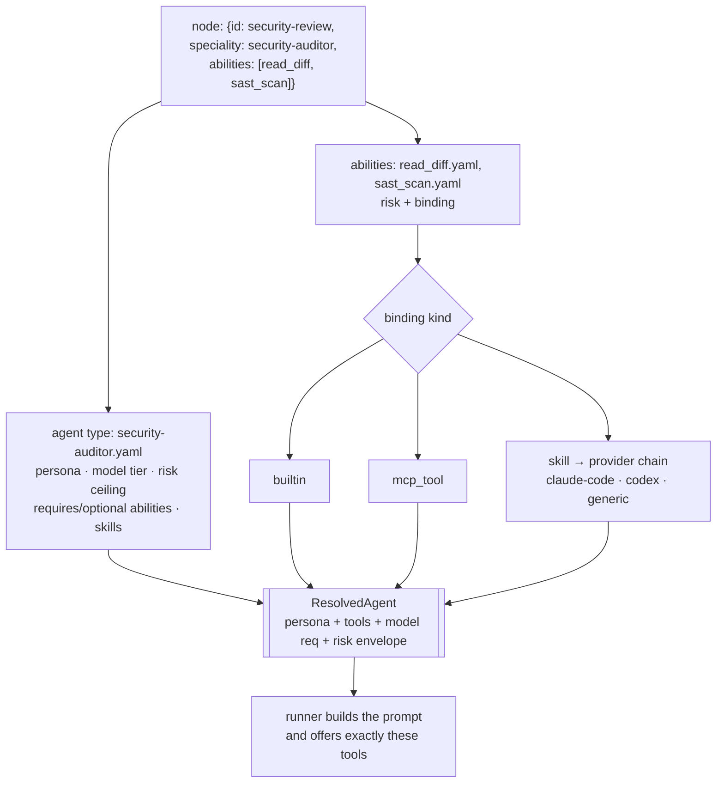
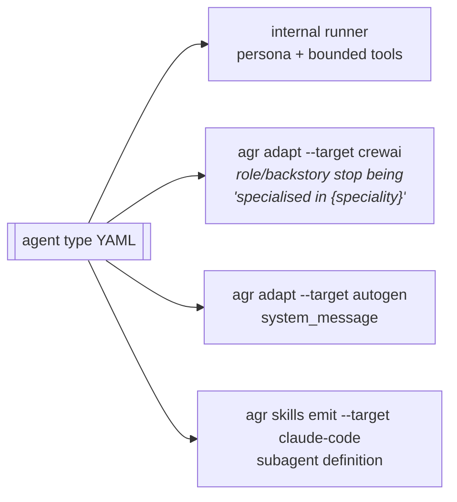
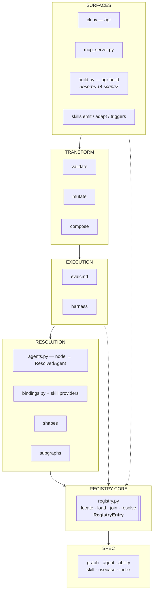

# Architecture — the registry core, the bundle, and the agent type

What agenticgraphs looks like after the two changes you asked about: *one place to
write when adding a graph or a skill*, and *specialized agent types as config*.
Architecture only — no plan, no sequencing. Measured against `a6f8464`.

---

## 1. What is actually there today

### 1.1 The module graph



**9 of 15 modules import `registry` directly** — it is the hub. But it offers only
`iter_graphs()`, `iter_yaml()`, `load()`, so every importer re-derives its own
partial view of what a graph *is*. There is no object called "a registry entry."

### 1.2 The shadow build system

`scripts/` holds **14 Python files** that are the real build: `gen_cards.py`,
`gen_scoreboard.py`, `gen_traces.py`, `gen_breadth_report.py`,
`gen_contract_findings.py`, `audit_usecases.py`, plus generators and derivers.
They are:

- **outside `src/`** — not shipped in the wheel (`force-include` lists
  `graphs`, `spec`, `specialities`, `abilities`, `evals`, `usecases`; not `scripts`),
- **untested** — the test suite covers `src/`, not the generators,
- **each carrying its own copy of the join** — graph.yaml + profile.json +
  cases.yaml + catalog entry, re-globbed and re-zipped in six places.

The Makefile and CI both call three of them by hand and then diff the tree.

### 1.3 Adding one graph: the file fan-out



Authored: 3 files, **one of which is a Python list every author edits**.
Generated-and-committed: 5 more, **four of them shared by every graph in the repo**.
Two branches adding two unrelated graphs conflict in all four.

The same is true of a skill or an ability today, one layer down: a new ability
needs `abilities/<name>.yaml` *and* a builtin in `bindings.py` *and* an entry in
that module's `BUILTINS` dict *and* one in its `SCHEMAS` dict.

### 1.4 The finding that changes the second question

I went looking for where an agent's configuration enters a run. It doesn't.

| Fact | Value |
|---|---|
| Speciality files | **34** |
| Fields they use | `name`, `description`, `requires_abilities`, `optional_abilities` |
| Specialities declaring `prompt_seed` (in the schema since M0) | **0 of 34** |
| Lines of runtime code reading `prompt_seed` | **0** |
| Lines of runtime code loading `specialities/*.yaml` at all | **0** |
| What the model actually receives | `f"You are node '{id}' (speciality: {node['speciality']}) in a workflow."` |
| Node-level fields for persona, model, or tools | **none** — 310 nodes carry `speciality` (a bare string) and `abilities` |

`requires_abilities` is read by exactly one consumer: the linter, to check the name
resolves. The speciality **file is never opened during a run**. `researcher.yaml`'s
description — "Gathers and grounds facts from sources" — has never reached a model.

So the agent layer is not missing. It is **declared, validated, and unwired** — the
same shape as the gaps M8, M9 and M10 closed, and the same shape as `binding`,
which sat in the ability schema from M0 with 0 of 32 abilities using it (now 3).

**agenticgraphs is graph-as-config with agent-as-*label*.**

---

## 2. The three structural changes

### 2.1 Vocabulary first — where skills actually sit

Your phrasing was "specialized agents (aka skills)". I'd separate those two, because
collapsing them is the one move that would make this architecture worse:

| Concept | Answers | Example | Kind |
|---|---|---|---|
| **Ability** | *what may be done* | `read_diff`, `sast_scan` | atomic verb, risk-typed |
| **Binding** | *how it is done* | `builtin` · `mcp_tool` · `shell` · **`skill`** | implementation of an ability |
| **Skill** | *a procedure a harness can run* | `claude-code:security-review` | **one binding kind**, not a peer |
| **Agent type** (today: speciality) | *who does it* | `security-auditor` | abilities + persona + model + risk ceiling |
| **Node** | *who does it, here* | `security-review` | agent type placed under a scoped contract |

A skill is not a kind of agent; it is a way an ability gets performed. An agent type
may reference several. Keeping skills at the binding layer means the bounded-toolbox
property `bindings.py` is built on — *a node may only do what it declared* — survives
contact with a user's harness. Making them peers of agent types would hand a role
capabilities its graph never declared, and that property is the reason these graphs
are auditable.

### 2.2 Change one — the **bundle** and the **projection**

One rule: **authored data is per-artifact; derived data is never committed by an
author.**



- Adding a graph becomes **one directory**. No shared file is touched, so N authors
  in parallel never conflict.
- The catalog entry moves from a Python list in a generator into the bundle it
  describes. `usecases/catalog.yaml` stays — as output.
- The six scattered joins collapse into `RegistryEntry`, and the 14 scripts collapse
  into `src/agenticgraphs/build.py` behind **`agr build`** — inside the package,
  under the test suite, shipped to contributors. CI stops calling three scripts by
  name and calls one command, then diffs, exactly as now.
- The same rule applies one layer down: a new ability is one file, and a new skill
  is one file, because the projection re-derives everything downstream of them.

**Open decision (§4.1):** whether `evals/<name>/` folds into the graph directory to
complete the bundle, or stays a parallel tree.

### 2.3 Change two — the **registry core** stops being a loader

`registry.py` today answers *where are the files*. It should answer *what is in the
registry*: locate → load → **join** → **resolve**. Resolution is the new part, and
it is what makes agent types real:



Precedence, stated so it can't drift:

1. **node overrides agent type overrides registry default** — for persona, model, outputs.
2. **abilities are a ceiling, never a grant** — the node's declared list bounds what
   resolves, whatever the role requires. A role asking for an ability the node did
   not declare is a lint error, not a silent grant.
3. **risk takes the minimum** — an agent type's `risk_ceiling: read` cannot be widened
   by a graph. Roles narrow; graphs never broaden.

### 2.4 Change three — the **agent type**

`specialities/security-auditor.yaml`, as a real config object:

```yaml
name: security-auditor
description: Finds exploitable defects and reports them with a location.
requires_abilities: [read_diff, sast_scan]
optional_abilities: [secret_detection]

prompt_seed: |                    # in the schema since M0, declared by 0, read by 0
  You look for defects an attacker could reach. Report severity and a file:line
  for every finding. A finding you cannot locate is not a finding.
skills: ["skill:security-review"] # role-level skill binding (resolved per §2.3)
model: {tier: reasoning}          # capability requirement, not a vendor pin
risk_ceiling: read                # this role never executes, whatever a graph says
outputs: {findings: "list[{file:any, line:int, severity:any}]"}
```

Every field except the first four is new surface — and `prompt_seed` isn't even
new, it just needs a reader. One config object then compiles four ways:



That last arrow is the second half of your skills question: the same agent type that
configures an internal run also *emits* a specialized agent into the user's harness.
Config in, agents out — in both directions, from one declaration.

Worth naming honestly: `adapters.py` currently emits `backstory="specialised in
{speciality}"` and `system_message="You are a {speciality} agent"`. Those are
placeholders because there was nothing else to read. This is what fills them.

---

## 3. The target architecture



Rules the current tree breaks and this one holds:

- **Nothing above layer 1 globs the filesystem.** Today `inspect`, `validate`,
  `subgraphs`, `bindings`, `mutate`, `evalcmd`, `mcp_server` and six scripts each do.
- **The join exists once.** Today it exists six times, in `scripts/`.
- **The build is code, not a Makefile convention.** Today three script invocations
  in a Makefile and a CI job, kept in sync by hand.
- **Config reaches the runtime.** Today 34 agent files reach it as one substring.

### What does *not* change

The AGR graph spec, the harness scheduler, the trace lock, the gate (schema + MAST
lint + resolvable roles + measured profile), the evidence grading vocabulary, and
every existing graph.yaml. This is a refactor of how the registry is *assembled and
resolved*, not of what a graph *is*.

---

## 4. Decisions taken

Recorded here so the plan does not re-litigate them.

| # | Decision | Chosen | Consequence |
|---|---|---|---|
| 4.1 | Does `evals/<name>/` fold into the graph bundle? | **Yes — `git mv` plus a path shim for one release** | One directory per graph. 83 directories and several hundred recordings move; `README.md`, the wheel's `force-include`, and `record_live.py` follow. |
| 4.2 | Where do agent types live? | **Keep `specialities/`, keep the `speciality:` node key** | The concept is promoted, not renamed. The schema grows to *AGR Agent v1.1*; 310 node references stay untouched. |
| 4.3 | How much of `scripts/` does `agr build` absorb? | **The six join scripts** — `gen_cards`, `gen_scoreboard`, `gen_traces`, `gen_breadth_report`, `gen_contract_findings`, `audit_usecases` | The duplicate joins come inside the package and under the test suite. `gen_v2_graphs.py` / `gen_v3_graphs.py` stay as history; `record_live.py` stays a recording tool. |
| 4.4 | Does an agent type declare a model requirement? | **Tiers only (`fast` \| `balanced` \| `reasoning`), advisory — the runner may ignore them** | A role can signal it needs reasoning depth without a vendor name entering a published registry artifact. |
