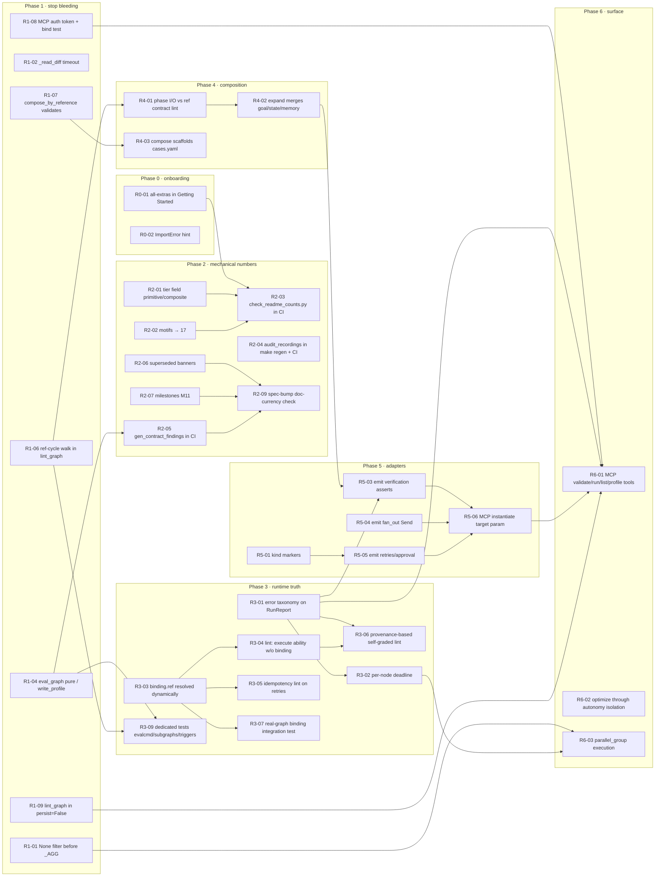

# Remediation plan for the 2026-09-04 gap audit

Source: [audit-gaps-2026-09-04.md](audit-gaps-2026-09-04.md), 50 findings, commit `aa486fc`.
Every finding below has an owner action, a phase, what it depends on, and what it
unblocks. Six findings need a human decision before work starts; they are marked
**DECIDE** and listed first.

Reading order: §1 decisions, §2 phase sequence, §3 dependency graph, §4 the full
table, §5 what "done" means per phase.

---

## 1. Decisions that gate work (make these first)

**Decided 2026-09-04 by the owner: Q1-Q6 all as recommended.** Execution: Phases 0+1
on branch `audit-remediation`, one commit per item, review checkpoint before Phase 2.

**Status 2026-09-04: Phases 0 and 1 done** (commits `10391ef`..`d25c7fa`, 12 commits,
435 tests green, 91.8% coverage, `make check` clean). Two things found on the way:

- **R1-01 uncovered a second bug in the same lines.** Under `on_partial: continue`
  the merged `error` key became a truthy list of per-shard errors, so one failed
  shard failed the whole node regardless of the aggregate. Fixed in the same commit;
  per-shard errors now publish as `shard_errors`.
- **Two tests wrote probes into the evidence store.** `test_superseded_recordings.py`
  planted recordings, called `eval_graph` (which wrote), then "restored" with a
  fresh date. They now use `write=False`. Without this, R1-04's change-gating still
  left one `profile.json` date-dirty after every suite run.

**Status 2026-09-04, later: all seven phases landed** on `audit-remediation` (42
commits, 526 tests, 92% coverage, `make check` clean, a4 audit passing with zero
verdict flips). Deviations from the plan, each deliberate:

- **R3-04** narrows "narration" to execute-risk and world-writing abilities;
  board-only writes (`generate`, `reduce_merge`, `write_docs`) are what a model does.
  38 graphs carry `unbound_ok`, not ~80.
- **R3-05** uses `retries.reissue_effects: true` (the node accepts a repeated
  effect) rather than an idempotency claim, because a bulk claim of safety would be
  the pattern the audit exists to refuse.
- **R3-06** recovered exactly the 16 graphs the stale report listed and fixed them
  structurally; the runtime now also refuses a node overwriting a caller input.
- **R4-01** adds explicit `maps` rather than renaming fifteen composites by guess;
  `fact-check-pipeline` gained a real `unsupported_claims` output because no child key
  meant that. `audit_recordings.py` now reports a verdict that moved with the shape as
  stale rather than as a flip, or every contract fix would have failed CI.
- **R6-03** keeps `steps` as node executions (the v1 trace lock depends on it) and
  adds `rounds` for scheduler passes; concurrency is observable as `rounds < steps`.
- Phase 2's `agr eval --journal` (R2-10) found that nothing had ever written the
  file `--resume-from` reads.

| # | Finding | Question | Recommended | If chosen, unlocks |
|---|---|---|---|---|
| Q1 | D2-01 | Bind the 29 unbound abilities for real (L), or lint-refuse/downgrade `risk: execute\|write` abilities that have no binding (S)? | **Lint first, bind later.** The lint makes the gap visible in 80-odd graphs today; real bindings are a per-ability roadmap. | Phase 3 R3-04 |
| Q2 | D3-01 | Implement `parallel_group` execution (L), or document the runtime as serial and change the lint to stop implying concurrency (S)? | **Document serial now, implement after Phase 3.** The runtime has no deadline or error taxonomy yet; concurrency on top of that multiplies unbounded failures. | Phase 6 R6-03 |
| Q3 | D0-4 | Keep a primitive/composite split in the README at all? | **Keep, derived from `ref:` presence.** It is the thesis ("composites reference, they don't copy"), so it should be a real field. | Phase 2 R2-01 |
| Q4 | D0-2 | Seed one backlog entry each for `supervisor-hierarchy` and `escalation-ladder`, or drop them to 17 motifs? | **Drop to 17.** Seed later if a use case demands it. | Phase 2 R2-02 |
| Q5 | D5-05 | CrewAI: emit `Process.hierarchical` with a looping manager (L), or emit a "loop dropped" comment (S)? | **Comment now.** Hierarchical CrewAI is a different adapter, not a fix. | Phase 5 R5-02 |
| Q6 | D7-02 | Route `agr optimize --autonomous` through `commit_autonomous_mutation`, or split the env var so the two paths stop sharing one flag? | **Route through isolation.** One flag, one blast radius. | Phase 6 R6-02 |

---

## 2. Phase sequence

Phases are ordered by dependency, not importance. Each phase is mergeable on its
own and leaves `agr validate`, `pytest`, and CI green. Effort is summed from the
audit's S/M/L (S≈½ day, M≈2 days, L≈1 week).

| Phase | Goal | Items | Effort | Depends on |
|---|---|---|---|---|
| **0** | A new contributor gets green on the documented path | R0-01..R0-07 | 7×S | nothing |
| **1** | Stop crashes, close the two safety gaps, make report generation read-only | R1-01..R1-11 | 10×S + 1×M | Phase 0 (so CI is trustworthy) |
| **2** | Every number in README/docs is generated and CI-checked; doc currency is enforced | R2-01..R2-11 | 8×S + 3×M | Q3, Q4; R1-04 (eval must be pure before contract-findings joins CI) |
| **3** | The runtime and linter tell the truth about abilities, errors, and self-grading | R3-01..R3-09 | 2×S + 6×M | Q1; R1-01, R1-02 |
| **4** | Composites carry a checked contract | R4-01..R4-03 | 1×S + 2×M | R1-06 (cycle walk in lint_graph) |
| **5** | Adapters carry the contract | R5-01..R5-06 | 3×S + 3×M | Q5; R3-01 (error taxonomy shapes emitted check output); R4-02 (expand must merge child goal/state before emission) |
| **6** | Surface and larger decisions | R6-01..R6-03 | 2×M + 1×L | Q2, Q6; R1-08 (auth before exposing run over HTTP); R3-01; R5-06 |

Critical path: **R1-04 → R2-05 → R2-09** (pure eval → contract-findings in CI → doc
currency) and **R3-01 → R3-02 → R6-01** (error taxonomy → per-node deadline → MCP
`run_graph`). Everything else can run in parallel inside its phase.

---

## 3. Dependency graph

---

## 4. Full remediation table

Columns: audit id → plan id, action, files, depends on, unblocks, effort. Test
column is the acceptance check that must exist before the item is closed.

### Phase 0 · onboarding (no dependencies, all parallel)

| plan | audit | action | files | test | eff |
|---|---|---|---|---|---|
| R0-01 | D9-1, D10-2 | Change Getting Started step 2 to `uv sync --all-extras`. Add a CI job `onboarding` that runs the three documented commands verbatim on a bare clone. | `README.md:329-339`, `.github/workflows/ci.yml` | CI job green on the documented path | S |
| R0-02 | D9-7 | Catch `ImportError` for `mcp` in `cli.py` `mcp` subcommand; print `install with: uv sync --all-extras`. | `cli.py:206`, `mcp_server.py:25` | `test_cli.py`: bare env prints hint, exit 2, no traceback | S |
| R0-03 | D9-2 | Delete the `# 52 graphs` comment in "Every number is checkable"; leave the command. | `README.md:391-396` | covered by R2-03 later | S |
| R0-04 | D9-5 | Delete the hand-typed domain distribution paragraph; the generated chart covers it. | `README.md:488-492` | — | S |
| R0-05 | D0-1, D0-3 | Delete stale prose counts: 52, 74 graphs; 112, 123 use cases. Point to the badge/generated block. Do not replace with new literals. | `README.md:319,347,394,405,418,431,488,494` | covered by R2-03 | S |
| R0-06 | D1-06 | Bump schema `title` to "AGR Graph v1.8". | `spec/agr-graph.schema.json:4` | `test_validate.py`: title matches max enum version | S |
| R0-07 | D3-05 | Add "(mock, provisional)" to the traces index column header. | `scripts/gen_traces.py` index emitter, `docs/traces/README.md` | regen diff clean in CI | S |

### Phase 1 · stop the bleeding

| plan | audit | action | files | depends | unblocks | test | eff |
|---|---|---|---|---|---|---|---|
| R1-01 | D1-01 | In `_fan_out`, drop shards without the aggregated key before `_AGG[op]`; record count in `rep.shards_failed`. Document `on_partial: continue` as "aggregate over succeeded shards". | `harness.py:1114-1185`, `docs/agr-v1.8.md` | — | R6-03 | `test_harness.py`: one failed shard + `median`/`best` → result, not `TypeError`; regression on `sales-call-scorer` fixture | S |
| R1-02 | D3-02a | Add `timeout=120` and `except (OSError, subprocess.SubprocessError)` to `_read_diff`, matching `_run_command`. | `bindings.py:83` | — | R3-02 | `test_bindings.py`: hung git → `ok=False` | S |
| R1-03 | D3-06 | Add the recorded local models to `_TOKEN_PRICES` at 0.0; keep `usd_measured` semantics. | `harness.py:836-845` | — | — | `test_harness.py`: `usd_max` trips at 0 spend only when configured | S |
| R1-04 | D6-04 | Split `eval_graph` into pure `compute_profile()` and explicit `write_profile()` that writes only when content (minus `date`) changed. `gen_contract_findings.py` calls compute only. | `evalcmd.py:87-201`, `scripts/gen_contract_findings.py` | — | R2-05, R3-09 | `test_evalcmd.py`: running the report generator leaves `git status` clean | M |
| R1-05 | D1-04 | Add `shards_processed` to `_RUNTIME_KEYS`. | `validate.py:73` | — | — | `test_validate.py`: guard on `shards_processed` lints clean | S |
| R1-06 | D4-02 | Add a ref-graph walk to `lint_graph` (reuse `subgraphs._resolve`), raising on cycle and depth > `MAX_DEPTH` without executing. | `validate.py:538-544`, `subgraphs.py:78-121` | — | R4-01, R3-09 | `test_subgraphs.py`: two-graph cycle fixture fails `agr validate` | S |
| R1-07 | D4-04 | `compose_by_reference` calls `validate_schema` + `lint_graph` and raises `ComposeError`; derive `apiVersion` from `max(child versions, current)`. | `compose.py:150-170` | — | R4-03 | `test_compose.py`: `--mode subgraph` output passes `agr validate` | S |
| R1-08 | D7-01, D8-01 | Require a bearer token (`AGR_MCP_TOKEN`) on the HTTP transport; refuse to start `--http` with `AGR_AUTONOMOUS=1` and no token. Test asserts `host == 127.0.0.1` on both SDK paths. | `mcp_server.py:102-118`, `docs/autonomy.md` | — | R6-01 | `test_mcp_server.py`: unauthenticated call → 401; bind host asserted | S |
| R1-09 | D7-03, D8-02 | `persist=False` branch calls `lint_graph`. Add the `persist=True` happy-path test through the registered tool. | `mcp_server.py:83-97`, `tests/test_mcp_server.py` | — | R6-01 | both branches share one gate; success path covered | S |
| R1-11 | D3-01 (interim, Q2) | Document the runtime as serial in `docs/agr-v1.8.md`; reword the `parallel_group` lint message to "declares a parallel group (runtime schedules serially)". Full implementation is R6-03. | `docs/agr-v1.8.md`, `validate.py:335-358` | Q2 | R6-03 | lint message text pinned | S |
| R1-10 | D1-05 | Decide and document: reachability is edge-kind-agnostic on purpose. Add a `warning` (not error) when a verifier is reachable only via `error`/`compensate` edges. | `validate.py:705-719`, `docs/agr-v1.8.md` | — | — | `test_validate.py`: fixture triggers the warning | S |

### Phase 2 · mechanical numbers and doc currency

| plan | audit | action | files | depends | unblocks | test | eff |
|---|---|---|---|---|---|---|---|
| R2-01 | D0-4 | Derive `tier: primitive\|composite` in `registry.py` from presence of `kind: subgraph`/`ref:`; expose in `agr list --json` and MCP search. | `registry.py`, `inspect.py` | Q3 | R2-03 | `test_registry_core.py`: 18 composites, 65 primitives at `aa486fc` | M |
| R2-02 | D0-2 | Remove `supervisor-hierarchy` and `escalation-ladder` from the motif table and badge; motif count becomes a generated number. | `README.md:132,412`, `scripts/gen_cards.py` | Q4 | R2-03 | `test_motif_claims.py`: every motif in the table has ≥1 graph | S |
| R2-03 | D9-6, D8-03, D8-06, D10-1 | New `scripts/check_readme_counts.py`: parses every badge and every number-bearing sentence (graphs, primitives, composites, motifs, use cases, domains, tests) and asserts against registry, catalog, and `pytest --collect-only`. Run in the CI staleness step. Replace `>= 50`/`>= 83` tests with the exact count from the same source. | new script, `ci.yml:23-32`, `tests/test_graphs_scale.py`, `tests/test_cli.py:23` | R0-01, R2-01, R2-02 | R2-09 | CI fails when any README number drifts | M |
| R2-04 | D6-02 | Un-ignore `reports/`; add `audit_recordings.py --json reports/a4-stale-recordings.json` to `make regen`; CI diffs it; CI fails on a verdict flip. | `reports/.gitignore`, `Makefile:14-17`, `ci.yml` | — | — | committed JSON references only paths that exist | S |
| R2-05 | D6-03 | Add `gen_contract_findings.py` to `make regen` and the CI stale-docs diff list. | `Makefile`, `ci.yml:23-32` | R1-04 | R2-09 | hand edit to `contract-findings.md` fails CI | S |
| R2-06 | D9-3 | Generated "Superseded by vX.Y" banner on every non-current `docs/agr-v1.*.md`, emitted by `gen_cards.py` from the schema enum. | `docs/agr-v1.{1,2,4,5,7}.md`, `scripts/gen_cards.py` | — | R2-09 | regen diff clean | S |
| R2-07 | D9-4 | Add `M11 / AGR v1.8` to milestones.md from `CHANGELOG.md`. | `docs/milestones.md` | — | R2-09 | — | S |
| R2-08 | D1-03 | Write `docs/agr-v1.3.md` (triggers, durability, budget, saga lint) and `docs/agr-v1.6.md` (provenance lint) in the existing format. | new docs | — | R2-09 | linked from README concepts table | S |
| R2-09 | D10-3 | CI check: a new `docs/agr-vX.md` requires (a) a milestones entry naming X, (b) banners on all lower versions, (c) schema `title` = X. | `ci.yml`, `scripts/check_readme_counts.py` | R2-05, R2-06, R2-07 | — | synthetic v1.9 doc without milestone entry fails CI | S |
| R2-10 | D3-04 | Document `durability.checkpoint` / `resume_from` and the journal line schema in `docs/agr-v1.8.md`; state what a version bump may change. | `docs/agr-v1.8.md`, `harness.py:938-946` | — | — | `test_harness.py` pins the journal line keys | S |
| R2-11 | D2-03 | Wire `optional_abilities` into `lint_graph`: warn when a node ability is neither required nor optional for its speciality. Leave `prompt_seed` as the tracked roadmap item. | `validate.py:753-769`, `specialities/*.yaml` | — | — | fixture with a stray ability warns | S |

### Phase 3 · runtime and linter truth

| plan | audit | action | files | depends | unblocks | test | eff |
|---|---|---|---|---|---|---|---|
| R3-01 | D3-03 | Add `parse_failures`, `gate_refused`, `timeouts` to `RunReport`; catch `ValueError` from `extract_json` and `HumanGateRequired` inside `run_graph`/`_run_gate`; `record_live.py` writes the typed outcome instead of a string. `gen_contract_findings.py` reports "unparseable" as its own column (closes UNVERIFIED D6-05). | `harness.py:180-286`, `scripts/record_live.py:200-203`, `scripts/gen_contract_findings.py:26-28` | — | R3-02, R3-06, R5-03, R6-01 | `test_harness.py`: each failure class lands in its field; scoreboard shows the column | M |
| R3-02 | D3-02b | Per-node wall-clock deadline in `run_graph` (`node.timeout_s`, default from `budget`); on expiry record `timeouts` and treat as node error. | `harness.py:969-1032`, `spec/agr-graph.schema.json` | R3-01, R1-02 | R6-03 | fake slow runner → `timeouts == 1`, run continues per `retries` | M |
| R3-03 | D2-02 | `bindings.available()` resolves `binding.ref` dynamically (`module:attr`); fix the three ability YAMLs to point at real symbols; `BUILTINS` becomes a fallback only. | `bindings.py:130-164`, `abilities/{run_command,read_diff,web_search}.yaml` | — | R3-04, R3-05, R3-07 | `test_bindings.py`: a YAML with a bad `ref` fails validate | M |
| R3-04 | D2-01 | Lint: any ability with `risk: execute\|write` and no resolvable binding is an **error** unless the graph declares `unbound_ok: true` with a reason. Expect ~80 graphs to need the annotation; that is the point. Real bindings for `edit_files`, `run_suite`, `rollback` are Phase 6+ follow-ups. | `validate.py:276-278`, `abilities/*.yaml`, graphs | Q1, R3-03 | R3-06 | `agr validate` green only with explicit annotations | M |
| R3-05 | D1-02 | Add `idempotent: bool` to the ability schema (default false for write/execute); lint `retries.max > 0` on a node with a non-idempotent ability as an error. Annotate the 39 nodes. | `spec/agr-ability.schema.json`, `validate.py`, 39 graph files | R3-03 | — | fixture: retry on `edit_files` fails validate | M |
| R3-06 | D6-01 | Replace `_lint_self_graded`'s regex with provenance: for each assert, every key read must trace (via `_upstream_outputs`) to a node that declares `inputs:` from `state.inputs` or a bound ability. Re-flag `returns-triage`, `ticket-triage-swarm`, and the other 14; fix by adding external inputs, not by rewording. Track `reports/self-graded.json` (see R2-04). | `validate.py:128-197,801-824`, 16 graphs | R3-01, R3-04 | — | the two reworded asserts fail validate again until fixed properly | M |
| R3-07 | D8-05 | Integration test: pick 3 registry graphs with `abilities:`, run `bind_for`/`invoke` under `allow_mutating=True` with stubbed subprocess, assert `ToolCall` trace shape. | `tests/test_tool_grounding.py` | R3-03 | — | — | S |
| R3-09 | D8-04 | Dedicated `test_evalcmd.py`, `test_subgraphs.py`, `test_triggers.py` covering the branches R1-04 and R1-06 introduced. | `tests/` | R1-04, R1-06 | — | coverage of those three modules ≥ 95% | S |

### Phase 4 · composition contract

| plan | audit | action | files | depends | unblocks | test | eff |
|---|---|---|---|---|---|---|---|
| R4-01 | D4-01 | Lint: for each `kind: subgraph` node, its `inputs` ⊆ `entry_nodes(ref).inputs` and its `outputs` ⊆ `_terminals(ref).outputs`. Record `ref_sha` (content hash) in `profile.json` so a changed primitive invalidates composite evidence. | `validate.py`, `subgraphs.py:31-58`, `evalcmd.py` | R1-06 | R4-02 | rename an output in a fixture primitive → composite fails validate | M |
| R4-02 | D4-03 | `expand()` merges child `goal.required` (OR), `state.schema` (union, conflict = error), `memory.scope` (max). Goal gate runs after expansion. Remove the 9 hand-duplicated `goal.required` lines once the merge is in. | `subgraphs.py:130-188`, `harness.py:884-911` | R4-01 | R5-03 | composite without its own `goal` refuses to run when a child requires one | M |
| R4-03 | D4-05 | `agr compose -o <dir>` scaffolds `graph.yaml`, `cases.yaml` (one golden case per child), empty `live/`, and a catalog stub; document manual onboarding otherwise. | `compose.py`, `cli.py`, `CONTRIBUTING.md` | R1-07 | — | composed dir passes `agr validate` and `agr eval --mock` | S |

### Phase 5 · adapters carry the contract

| plan | audit | action | files | depends | unblocks | test | eff |
|---|---|---|---|---|---|---|---|
| R5-01 | D5-04 | Emit `# HUMAN GATE` / `# VERIFIER` markers; human nodes raise by default rather than returning. Both LangGraph and CrewAI. | `adapters.py:117-213` | — | R5-05 | `test_adapters.py`: markers present for every `kind` node | S |
| R5-02 | D5-05 | Emit `# NOTE: CrewAI sequential cannot re-enter this task; loop dropped` on every loop-back edge. | `adapters.py:164-213` | Q5 | — | comment count == loop-back edge count | S |
| R5-03 | D5-01 | Emit `verification[].assert` as `check_contract(state)` using `_EMITTED_GUARD`; LangGraph: final node before END; CrewAI: `@after_kickoff` callback. `command:` entries emit as a documented subprocess stub. Return the same typed failure classes as R3-01. | `adapters.py:42-161`, `tests/test_adapters.py` | R3-01, R4-02 | R5-06 | every assert string appears in the generated source; `test_emitted_modules_do_not_ship_a_bare_eval` still passes | M |
| R5-04 | D5-02 | LangGraph: emit `Send()` fan-out over `fan_out.over` with `max` cap and `on_partial` handling mirroring R1-01; CrewAI: unsupported comment. | `adapters.py` | R1-01 | R5-06 | `vendor-comparison-matrix` output contains `Send(` | M |
| R5-05 | D5-03 | Wrap node call in a `retries.max` loop; emit `approval.contract` as a guard the human-gate stub must satisfy; `on_timeout` as a routing branch. | `adapters.py` | R5-01 | R5-06 | `feature-delivery-lifecycle` output contains retry loop and approval guard | M |
| R5-06 | D5-06 | MCP `instantiate(name, target)` accepts `langgraph\|crewai\|autogen`; add `agr instantiate` as an alias of `adapt`; update README:529. | `mcp_server.py:53-61`, `cli.py:70-71`, `README.md:529` | R5-03, R5-04, R5-05 | R6-01 | `test_mcp_server.py`: three targets round-trip | S |

### Phase 6 · surface and larger decisions

| plan | audit | action | files | depends | unblocks | test | eff |
|---|---|---|---|---|---|---|---|
| R6-01 | D7-04 | Add MCP tools `validate_graph`, `run_graph` (mock runner by default; live requires token + `run_commands` opt-in), `list_abilities`, `list_specialities`, `get_profile`, `diff_graphs`. | `mcp_server.py` | R1-08, R1-09, R3-01, R5-06 | — | each tool has a wrapper-level test | M |
| R6-02 | D7-02 | Route `agr optimize --apply --autonomous` through `commit_autonomous_mutation`; delete the paragraph in `autonomy.md:82-87` that documents the exception. | `cli.py`, `autonomy.py:84-116`, `docs/autonomy.md` | Q6 | — | `test_autonomy.py`: optimize writes land on `auto/mutations` only | M |
| R6-03 | D3-01 | Execute same-`parallel_group` ready nodes concurrently per step (thread pool, one `rep.steps` increment per batch); until then, Q2's documentation change ships in Phase 1 as R1-11 (one paragraph in `agr-v1.8.md` + lint message wording). | `harness.py:969`, `validate.py:335-358` | Q2, R1-01, R3-02 | — | `test_harness.py`: two parallel nodes complete in one step; failure in one does not lose the other | L |

Findings not in a phase because they are corrections to the audit brief, not the
repo: D0-5 (brief's "112 dirs", "103 graphs", `agr instantiate`, "28 test files").
Fixed in the brief file directly when it is next revised.

---

## 5. Definition of done per phase

| Phase | Exit criterion (all must hold) |
|---|---|
| 0 | `git clone && uv sync --all-extras && uv run agr validate && uv run pytest -q` green in a new CI job; README has no hand-typed graph/use-case count. |
| 1 | `sales-call-scorer` with one failed shard returns a verdict; `git status` clean after `make regen`; MCP `--http` refuses to start autonomous without a token; `compose --mode subgraph` output validates; ref cycle fails `agr validate`. |
| 2 | `scripts/check_readme_counts.py` passes in CI; `reports/` is tracked and regenerated; every non-current spec doc carries a banner; milestones has M11; a synthetic v1.9 doc without a milestone entry fails CI. |
| 3 | `RunReport` distinguishes parse/refusal/timeout/contract failure and the scoreboard shows an "unparseable" column; every execute/write ability either resolves a binding or carries an explicit `unbound_ok` reason; `returns-triage` and `ticket-triage-swarm` asserts read at least one externally-sourced key; 39 retry nodes declare idempotency. |
| 4 | Renaming a primitive output breaks every composite that references it at `agr validate` time; a composite inherits a child's `goal.required` without hand-duplication. |
| 5 | Every `verification[].assert` string appears in generated LangGraph and CrewAI source; `fan_out` emits `Send()`; human gates raise by default; MCP `instantiate` serves three targets. |
| 6 | Six new MCP tools tested at the wrapper; `optimize --autonomous` cannot touch the live checkout; `parallel_group` nodes run in one step or the lint no longer implies they do. |

Total: 50 findings → 48 plan items (D8-03/D8-06/D10-1 fold into R2-03, D0-5 is a brief correction), 31 S, 16 M, 1 L. Roughly 13 working
days of S+M before the two L items, with Phases 0-1 (~6 days) delivering every
crash, safety, and onboarding fix.
