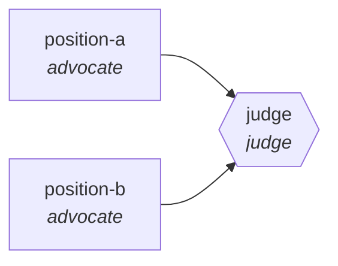

<!-- generated by scripts/gen_traces.py — edit graph.yaml / evals/<name>/cases.yaml, then `uv run python scripts/gen_traces.py` -->
# 🔍 Trace gallery · `ab-test-analysis`

> Two analysts argue significance and pitfalls, judge writes readout.

2 golden case(s), 2/2 passing (`mock` runner, provisional).

## The graph

## Cases

### `significant-effect-confirmed` — ✅ passed

**Route** (3 step(s)): `position-a` → `position-b` → `judge`

| # | Node | Output |
|---|---|---|
| 1 | `position-a` | `argument='effect is real and significant'` |
| 2 | `position-b` | `argument='effect could be noise'` |
| 3 | `judge` | `output={'recomputed_effect': 0.12, 'claimed_effect': 0.12, 'reproduces_claimed_effect': True}` |

**Verification checked:**

- ✅ `abs(output.recomputed_effect - output.claimed_effect) < 0.01`

### `null-result-confirmed` — ✅ passed

**Route** (3 step(s)): `position-a` → `position-b` → `judge`

| # | Node | Output |
|---|---|---|
| 1 | `position-a` | `argument='no significant effect observed'` |
| 2 | `position-b` | `argument='agrees, effect is not significant'` |
| 3 | `judge` | `output={'recomputed_effect': 0.0, 'claimed_effect': 0.0, 'reproduces_claimed_effect': True}` |

**Verification checked:**

- ✅ `abs(output.recomputed_effect - output.claimed_effect) < 0.01`

---
*Regenerate: `uv run python scripts/gen_traces.py` · [Trace gallery index](README.md) · [Graph card](../../graphs/data-analytics/ab-test-analysis/CARD.md)*
