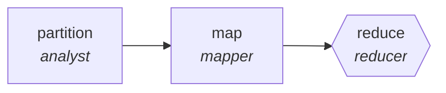

<!-- generated by scripts/gen_traces.py — edit graph.yaml / evals/<name>/cases.yaml, then `uv run python scripts/gen_traces.py` -->
# 🔍 Trace gallery · `adverse-event-scanner`

> Scan reports for adverse-event signals, reduce to summary.

2 golden case(s), 2/2 passing (`mock` runner, provisional).

## The graph

## Cases

### `single-item` — ✅ passed

**Route** (3 step(s)): `partition` → `map` → `reduce`

| # | Node | Output |
|---|---|---|
| 1 | `partition` | `shard_count=1` |
| 2 | `map` | *(no fixture — empty output)* |
| 3 | `reduce` | `output={'signals': [{'type': 'nausea', 'report_ids': ['R1', 'R2'], 'count': 2}]}` |

**Verification checked:**

- ✅ `all(s.report_ids and s.report_ids[s.count - 1:] and not s.report_ids[s.count:] for s in output.signals)`

### `multi-item` — ✅ passed

**Route** (3 step(s)): `partition` → `map` → `reduce`

| # | Node | Output |
|---|---|---|
| 1 | `partition` | `shard_count=2` |
| 2 | `map` | *(no fixture — empty output)* |
| 3 | `reduce` | `output={'signals': [{'type': 'nausea', 'report_ids': ['R1', 'R2'], 'count': 2}, {'type': 'headache', 'report_ids': ['R3'], 'count': 1}]}` |

**Verification checked:**

- ✅ `all(s.report_ids and s.report_ids[s.count - 1:] and not s.report_ids[s.count:] for s in output.signals)`

---
*Regenerate: `uv run python scripts/gen_traces.py` · [Trace gallery index](README.md) · [Graph card](../../graphs/healthcare-science/adverse-event-scanner/CARD.md)*
