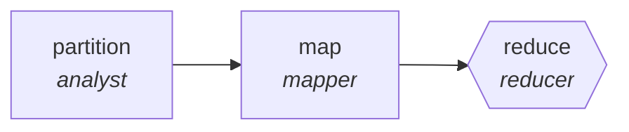

<!-- generated by scripts/gen_traces.py — edit graph.yaml / evals/<name>/cases.yaml, then `uv run python scripts/gen_traces.py` -->
# 🔍 Trace gallery · `alert-noise-reduction`

> Cluster alerts, dedupe storms, emit one incident per cause.

2 golden case(s), 2/2 passing (`mock` runner, provisional).

## The graph

## Cases

### `single-item` — ✅ passed

**Route** (3 step(s)): `partition` → `map` → `reduce`

| # | Node | Output |
|---|---|---|
| 1 | `partition` | `shard_count=1, shards=[{'i': 1}, {'i': 2}, {'i': 3}]` |
| 2 | `map` | *(no fixture — empty output)* |
| 3 | `reduce` | `output={'dedupe_ratio': 0.8, 'missed_paging_alerts': []}` |

**Verification checked:**

- ✅ `output.dedupe_ratio > 0 and not output.missed_paging_alerts`

### `multi-item` — ✅ passed

**Route** (3 step(s)): `partition` → `map` → `reduce`

| # | Node | Output |
|---|---|---|
| 1 | `partition` | `shard_count=2, shards=[{'i': 1}, {'i': 2}, {'i': 3}]` |
| 2 | `map` | *(no fixture — empty output)* |
| 3 | `reduce` | `output={'dedupe_ratio': 0.4, 'missed_paging_alerts': []}` |

**Verification checked:**

- ✅ `output.dedupe_ratio > 0 and not output.missed_paging_alerts`

---
*Regenerate: `uv run python scripts/gen_traces.py` · [Trace gallery index](README.md) · [Graph card](../../graphs/devops-sre/alert-noise-reduction/CARD.md)*
