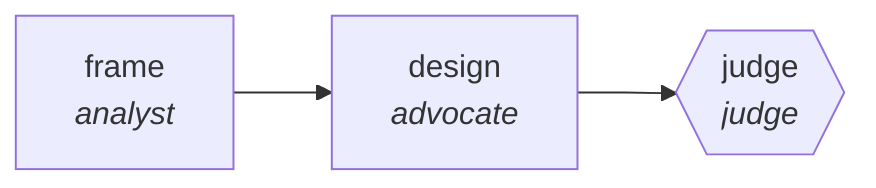

<!-- generated by scripts/gen_traces.py — edit graph.yaml / cases.yaml, then `uv run python scripts/gen_traces.py` -->
# 🔍 Trace gallery · `architecture-decision-tournament`

> Independent designs are scored on one rubric, and the winner must beat the runner-up on record.

1 golden case(s), 1/1 passing (`mock` runner, provisional).

## The graph

## Cases

### `happy-path` — ✅ passed

**Route** (3 step(s)): `frame` → `design` → `judge`

| # | Node | Output |
|---|---|---|
| 1 | `frame` | `options=[{'o': 'a'}, {'o': 'b'}, {'o': 'c'}], rubric='rubric-value'` |
| 2 | `design` | `proposal='proposal-value', rubric_score=7` |
| 3 | `judge` | `winner='option-b', margin=0.18, output={'designs_scored': 3, 'margin': 0.18, 'winner': 'option-b'}` |

**Verification checked:**

- ✅ `output.designs_scored >= 3`
- ✅ `output.margin is not None`

---
*Regenerate: `uv run python scripts/gen_traces.py` · [Trace gallery index](README.md) · [Graph card](../../graphs/software-engineering/architecture-decision-tournament/CARD.md)*
