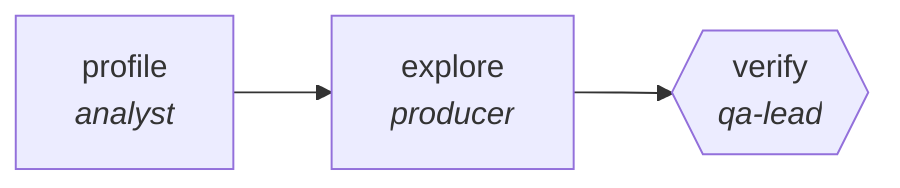

<!-- generated by scripts/gen_traces.py — edit graph.yaml / evals/<name>/cases.yaml, then `uv run python scripts/gen_traces.py` -->
# 🔍 Trace gallery · `benchmark-driven-optimization-search`

> Branch candidate optimizations, score each on a real benchmark, keep the beam, prune the rest.

1 golden case(s), 1/1 passing (`mock` runner, provisional).

## The graph

## Cases

### `happy-path` — ✅ passed

**Route** (3 step(s)): `profile` → `explore` → `verify`

| # | Node | Output |
|---|---|---|
| 1 | `profile` | `hotspot='hotspot-value', baseline_ms=400` |
| 2 | `explore` | `patch='patch-value', bench_ms=120` |
| 3 | `verify` | `suite_green=True, output={'bench_ms': 120, 'baseline_ms': 400, 'suite_green': True}, bench_ms=120` |

**Verification checked:**

- ✅ `output.bench_ms < output.baseline_ms`
- ✅ `output.suite_green == true`

---
*Regenerate: `uv run python scripts/gen_traces.py` · [Trace gallery index](README.md) · [Graph card](../../graphs/software-engineering/benchmark-driven-optimization-search/CARD.md)*
