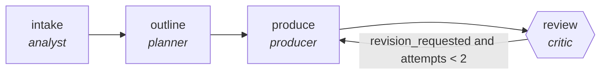

<!-- generated by scripts/gen_traces.py — edit graph.yaml / cases.yaml, then `uv run python scripts/gen_traces.py` -->
# 🔍 Trace gallery · `blog-production-pipeline`

> Brief to outline to draft to edit to publish-ready post.

2 golden case(s), 2/2 passing (`mock` runner, provisional).

## The graph

## Cases

### `happy-path` — ✅ passed

**Route** (4 step(s)): `intake` → `outline` → `produce` → `review`

| # | Node | Output |
|---|---|---|
| 1 | `intake` | `summary='intake complete'` |
| 2 | `outline` | `outline=[{'section': 'why', 'claim': 'c', 'evidence': 'e'}]` |
| 3 | `produce` | `output={'lint_passed': True, 'plagiarism_clean': True}` |
| 4 | `review` | `revision_requested=False, attempts=1` |

**Verification checked:**

- ✅ `output.lint_passed and output.plagiarism_clean`

### `retry-then-resolved` — ✅ passed

**Route** (6 step(s)): `intake` → `outline` → `produce` → `review` → `produce` → `review`

| # | Node | Output |
|---|---|---|
| 1 | `intake` | `summary='intake complete'` |
| 2 | `outline` | `outline=[{'section': 'why', 'claim': 'c', 'evidence': 'e'}]` |
| 3 | `produce` | `output={'lint_passed': False, 'plagiarism_clean': False}` |
| 4 | `review` | `revision_requested=True, attempts=1` |
| 5 | `produce` | `output={'lint_passed': True, 'plagiarism_clean': True}` |
| 6 | `review` | `revision_requested=False, attempts=2` |

**Verification checked:**

- ✅ `output.lint_passed and output.plagiarism_clean`

---
*Regenerate: `uv run python scripts/gen_traces.py` · [Trace gallery index](README.md) · [Graph card](../../graphs/content-marketing/blog-production-pipeline/CARD.md)*
