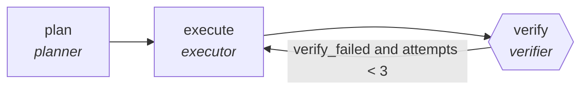

<!-- generated by scripts/gen_traces.py — edit graph.yaml / cases.yaml, then `uv run python scripts/gen_traces.py` -->
# 🔍 Trace gallery · `bug-triage-and-fix`

> Reproduce a bug, plan a fix, apply it in isolation, verify.

2 golden case(s), 2/2 passing (`mock` runner, provisional).

## The graph

## Cases

### `first-attempt-verified` — ✅ passed

**Route** (3 step(s)): `plan` → `execute` → `verify`

| # | Node | Output |
|---|---|---|
| 1 | `plan` | `steps=['decompose goal']` |
| 2 | `execute` | `step_result={'step': 1, 'status': 'done'}` |
| 3 | `verify` | `verify_failed=False, attempts=1, output={'test_failed_before_patch': True, 'test_passes_after_patch': True}` |

**Verification checked:**

- ✅ `output.test_failed_before_patch and output.test_passes_after_patch`
- ⏭️ `pytest -q {test_path}` — command checks are skipped by the mock runner (run with `--live` against a real environment to exercise them)

### `retry-then-verified` — ✅ passed

**Route** (5 step(s)): `plan` → `execute` → `verify` → `execute` → `verify`

| # | Node | Output |
|---|---|---|
| 1 | `plan` | `steps=['decompose goal']` |
| 2 | `execute` | `step_result={'step': 1, 'status': 'done'}` |
| 3 | `verify` | `verify_failed=True, attempts=1` |
| 4 | `execute` | `step_result={'step': 1, 'status': 'done'}` |
| 5 | `verify` | `verify_failed=False, attempts=2, output={'test_failed_before_patch': True, 'test_passes_after_patch': True}` |

**Verification checked:**

- ✅ `output.test_failed_before_patch and output.test_passes_after_patch`
- ⏭️ `pytest -q {test_path}` — command checks are skipped by the mock runner (run with `--live` against a real environment to exercise them)

---
*Regenerate: `uv run python scripts/gen_traces.py` · [Trace gallery index](README.md) · [Graph card](../../graphs/software-engineering/bug-triage-and-fix/CARD.md)*
