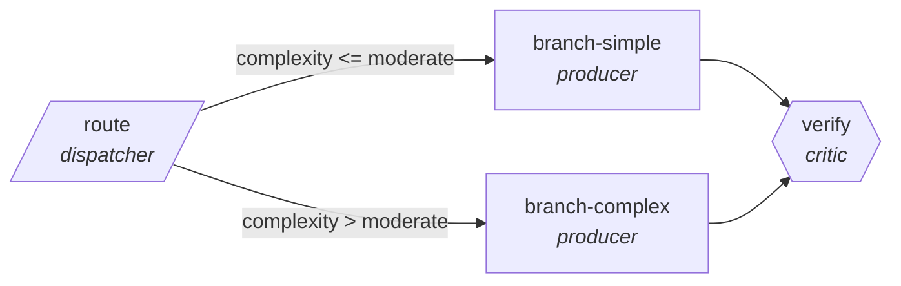

<!-- generated by scripts/gen_traces.py — edit graph.yaml / cases.yaml, then `uv run python scripts/gen_traces.py` -->
# 🔍 Trace gallery · `clinical-literature-triage`

> Route new papers by study type and evidence level.

2 golden case(s), 2/2 passing (`mock` runner, provisional).

## The graph

## Cases

### `simple-branch` — ✅ passed

**Route** (3 step(s)): `route` → `branch-simple` → `verify`

| # | Node | Output |
|---|---|---|
| 1 | `route` | `complexity='low'` |
| 2 | `branch-simple` | `handled_by='simple'` |
| 3 | `verify` | `output={'label': 'RCT', 'matches_validated_set': True}` |

**Verification checked:**

- ✅ `output.matches_validated_set`

### `complex-branch` — ✅ passed

**Route** (3 step(s)): `route` → `branch-complex` → `verify`

| # | Node | Output |
|---|---|---|
| 1 | `route` | `complexity='high'` |
| 2 | `branch-complex` | `handled_by='complex'` |
| 3 | `verify` | `output={'label': 'RCT', 'matches_validated_set': True}` |

**Verification checked:**

- ✅ `output.matches_validated_set`

---
*Regenerate: `uv run python scripts/gen_traces.py` · [Trace gallery index](README.md) · [Graph card](../../graphs/healthcare-science/clinical-literature-triage/CARD.md)*
