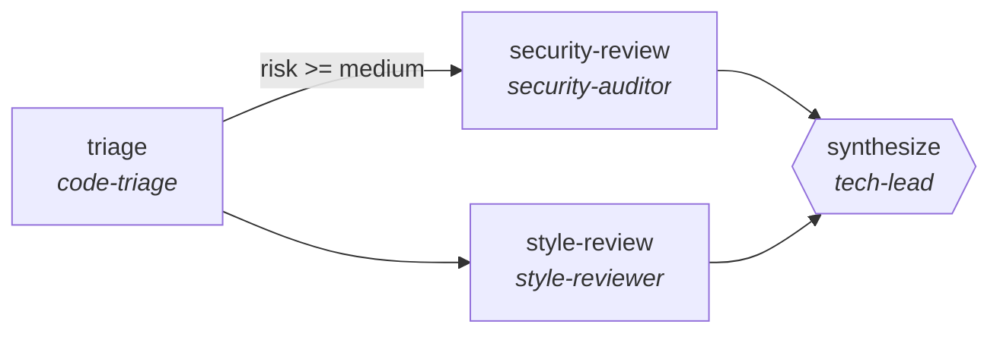

<!-- generated by scripts/gen_traces.py — edit graph.yaml / evals/<name>/cases.yaml, then `uv run python scripts/gen_traces.py` -->
# 🔍 Trace gallery · `code-review-pipeline`

> Multi-stage PR review that triages risk, splits security and style review, and synthesizes one verdict.

2 golden case(s), 2/2 passing (`mock` runner, provisional).

## The graph

## Cases

### `low-risk-clean-approve` — ✅ passed

**Route** (3 step(s)): `triage` → `style-review` → `synthesize`

| # | Node | Output |
|---|---|---|
| 1 | `triage` | `risk='low'` |
| 2 | `style-review` | `style_findings=[]` |
| 3 | `synthesize` | `output={'verdict': 'approve', 'findings': []}` |

**Verification checked:**

- ✅ `output.verdict in ['approve','request_changes']`
- ✅ `all(f.file and f.line for f in output.findings)`

### `high-risk-blocks-with-located-findings` — ✅ passed

**Route** (4 step(s)): `triage` → `security-review` → `style-review` → `synthesize`

| # | Node | Output |
|---|---|---|
| 1 | `triage` | `risk='high'` |
| 2 | `security-review` | `sec_hits=1` |
| 3 | `style-review` | `style_findings=[]` |
| 4 | `synthesize` | `output={'verdict': 'request_changes', 'findings': [{'file': 'app.py', 'line': 42, 'note': 'hardcoded secret'}]}` |

**Verification checked:**

- ✅ `output.verdict in ['approve','request_changes']`
- ✅ `all(f.file and f.line for f in output.findings)`

---
*Regenerate: `uv run python scripts/gen_traces.py` · [Trace gallery index](README.md) · [Graph card](../../graphs/software-engineering/code-review-pipeline/CARD.md)*
