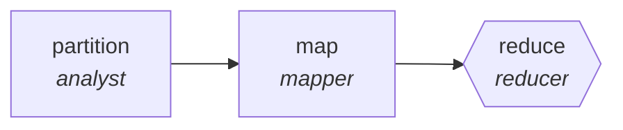

<!-- generated by scripts/gen_traces.py — edit graph.yaml / evals/<name>/cases.yaml, then `uv run python scripts/gen_traces.py` -->
# 🔍 Trace gallery · `competitive-intelligence`

> Scan competitor releases and filings, reduce to a delta brief.

2 golden case(s), 2/2 passing (`mock` runner, provisional).

## The graph

## Cases

### `single-item` — ✅ passed

**Route** (3 step(s)): `partition` → `map` → `reduce`

| # | Node | Output |
|---|---|---|
| 1 | `partition` | `shard_count=1` |
| 2 | `map` | *(no fixture — empty output)* |
| 3 | `reduce` | `output={'findings': [{'title': 'competitor launched feature X', 'source_url': 'https://example.com/blog', 'source_date': '2026-07-01'}]}` |

**Verification checked:**

- ✅ `all(f.source_url and f.source_date for f in output.findings)`

### `multi-item` — ✅ passed

**Route** (3 step(s)): `partition` → `map` → `reduce`

| # | Node | Output |
|---|---|---|
| 1 | `partition` | `shard_count=2` |
| 2 | `map` | *(no fixture — empty output)* |
| 3 | `reduce` | `output={'findings': [{'title': 'competitor launched feature X', 'source_url': 'https://example.com/blog', 'source_date': '2026-07-01'}, {'title': 'competitor raised prices', 'source_url': 'https://example.com/news', 'source_date': '2026-07-15'}]}` |

**Verification checked:**

- ✅ `all(f.source_url and f.source_date for f in output.findings)`

---
*Regenerate: `uv run python scripts/gen_traces.py` · [Trace gallery index](README.md) · [Graph card](../../graphs/research-knowledge/competitive-intelligence/CARD.md)*
