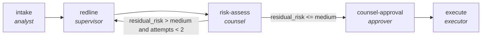

<!-- generated by scripts/gen_traces.py — edit graph.yaml / evals/<name>/cases.yaml, then `uv run python scripts/gen_traces.py` -->
# 🔍 Trace gallery · `contract-lifecycle`

> Intake a contract, redline it, gate on residual risk, and execute only with counsel approval.

1 golden case(s), 1/1 passing (`mock` runner, provisional).

## The graph

## Cases

### `happy-path` — ✅ passed

**Route** (7 step(s)): `intake` → `redline.intake` → `redline.produce` → `redline.review` → `risk-assess` → `counsel-approval` → `execute`

| # | Node | Output |
|---|---|---|
| 1 | `intake` | `clauses=[]` |
| 2 | `redline.intake` | `summary='intake complete'` |
| 3 | `redline.produce` | `output={'redlines': [{'clause': 'limitation of liability', 'playbook_ref': 'PB-4'}]}` |
| 4 | `redline.review` | `redlines=[{'clause': 7, 'playbook_ref': 'value'}], revision_requested=False, attempts=1` |
| 5 | `risk-assess` | `residual_risk='low'` |
| 6 | `counsel-approval` | `signed_off=True` |
| 7 | `execute` | `executed=True, output={'residual_risk_level': 'low', 'signed_off': True, 'executed': True}` |

**Verification checked:**

- ✅ `output.residual_risk_level in ['low','medium']`
- ✅ `output.signed_off == true`
- ✅ `output.executed == true`

---
*Regenerate: `uv run python scripts/gen_traces.py` · [Trace gallery index](README.md) · [Graph card](../../graphs/legal-compliance/contract-lifecycle/CARD.md)*
