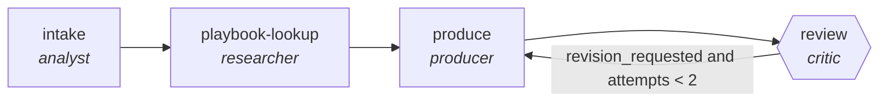

<!-- generated by scripts/gen_traces.py — edit graph.yaml / cases.yaml, then `uv run python scripts/gen_traces.py` -->
# 🔍 Trace gallery · `contract-redline-pipeline`

> Compare against playbook, propose redlines with rationale.

2 golden case(s), 2/2 passing (`mock` runner, provisional).

## The graph

## Cases

### `happy-path` — ✅ passed

**Route** (4 step(s)): `intake` → `playbook-lookup` → `produce` → `review`

| # | Node | Output |
|---|---|---|
| 1 | `intake` | `summary='intake complete'` |
| 2 | `playbook-lookup` | `playbook_positions=[{'clause': 'indemnity', 'position': 'mutual'}]` |
| 3 | `produce` | `output={'redlines': [{'clause': 'limitation of liability', 'playbook_ref': 'PB-4'}]}` |
| 4 | `review` | `revision_requested=False, attempts=1` |

**Verification checked:**

- ✅ `all(r.playbook_ref for r in output.redlines)`

### `retry-then-resolved` — ✅ passed

**Route** (6 step(s)): `intake` → `playbook-lookup` → `produce` → `review` → `produce` → `review`

| # | Node | Output |
|---|---|---|
| 1 | `intake` | `summary='intake complete'` |
| 2 | `playbook-lookup` | `playbook_positions=[{'clause': 'indemnity', 'position': 'mutual'}]` |
| 3 | `produce` | `output={'redlines': [{'clause': 'limitation of liability', 'playbook_ref': ''}]}` |
| 4 | `review` | `revision_requested=True, attempts=1` |
| 5 | `produce` | `output={'redlines': [{'clause': 'limitation of liability', 'playbook_ref': 'PB-4'}]}` |
| 6 | `review` | `revision_requested=False, attempts=2` |

**Verification checked:**

- ✅ `all(r.playbook_ref for r in output.redlines)`

---
*Regenerate: `uv run python scripts/gen_traces.py` · [Trace gallery index](README.md) · [Graph card](../../graphs/legal-compliance/contract-redline-pipeline/CARD.md)*
