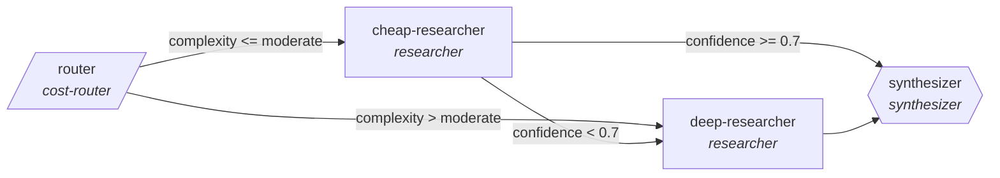

<!-- generated by scripts/gen_traces.py — edit graph.yaml / cases.yaml, then `uv run python scripts/gen_traces.py` -->
# 🔍 Trace gallery · `cost-routed-research`

> Routes research subtasks to the cheapest capable model, escalates low-confidence answers, synthesizes with citations.

3 golden case(s), 3/3 passing (`mock` runner, provisional).

## The graph

## Cases

### `simple-stays-cheap` — ✅ passed

**Route** (3 step(s)): `router` → `cheap-researcher` → `synthesizer`

| # | Node | Output |
|---|---|---|
| 1 | `router` | `complexity='simple'` |
| 2 | `cheap-researcher` | `confidence=0.9` |
| 3 | `synthesizer` | `output={'claims': [{'text': 'answer', 'sources': ['src-1']}]}` |

**Verification checked:**

- ✅ `all(c.sources for c in output.claims)`

### `low-confidence-escalates` — ✅ passed

**Route** (4 step(s)): `router` → `cheap-researcher` → `deep-researcher` → `synthesizer`

| # | Node | Output |
|---|---|---|
| 1 | `router` | `complexity='simple'` |
| 2 | `cheap-researcher` | `confidence=0.4` |
| 3 | `deep-researcher` | `confidence=0.95` |
| 4 | `synthesizer` | `output={'claims': [{'text': 'answer', 'sources': ['src-1', 'src-2']}]}` |

**Verification checked:**

- ✅ `all(c.sources for c in output.claims)`

### `complex-goes-deep` — ✅ passed

**Route** (3 step(s)): `router` → `deep-researcher` → `synthesizer`

| # | Node | Output |
|---|---|---|
| 1 | `router` | `complexity='complex'` |
| 2 | `deep-researcher` | `confidence=0.9` |
| 3 | `synthesizer` | `output={'claims': [{'text': 'answer', 'sources': ['src-1']}]}` |

**Verification checked:**

- ✅ `all(c.sources for c in output.claims)`

---
*Regenerate: `uv run python scripts/gen_traces.py` · [Trace gallery index](README.md) · [Graph card](../../graphs/research-knowledge/cost-routed-research/CARD.md)*
