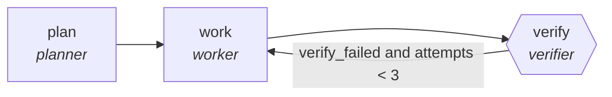

<!-- generated by scripts/gen_traces.py — edit graph.yaml / cases.yaml, then `uv run python scripts/gen_traces.py` -->
# 🔍 Trace gallery · `data-quality-audit`

> Workers profile each table for nulls, drift, and duplicates.

2 golden case(s), 2/2 passing (`mock` runner, provisional).

## The graph

## Cases

### `first-attempt-verified` — ✅ passed

**Route** (3 step(s)): `plan` → `work` → `verify`

| # | Node | Output |
|---|---|---|
| 1 | `plan` | `steps=['decompose goal'], tasks=[{'i': 1}, {'i': 2}, {'i': 3}]` |
| 2 | `work` | `work_result=[{'id': 1, 'status': 'done'}]` |
| 3 | `verify` | `verify_failed=False, attempts=1, output={'violations': [{'rule_id': 'null-check', 'count': 3}]}` |

**Verification checked:**

- ✅ `all(v.rule_id and v.count >= 0 for v in output.violations)`
- ⏭️ `dbt test --select {model_name}` — command checks are skipped by the mock runner (run with `--live` against a real environment to exercise them)

### `retry-then-verified` — ✅ passed

**Route** (5 step(s)): `plan` → `work` → `verify` → `work` → `verify`

| # | Node | Output |
|---|---|---|
| 1 | `plan` | `steps=['decompose goal'], tasks=[{'i': 1}, {'i': 2}, {'i': 3}]` |
| 2 | `work` | `work_result=[{'id': 1, 'status': 'done'}]` |
| 3 | `verify` | `verify_failed=True, attempts=1` |
| 4 | `work` | `work_result=[{'id': 1, 'status': 'done'}]` |
| 5 | `verify` | `verify_failed=False, attempts=2, output={'violations': [{'rule_id': 'null-check', 'count': 3}]}` |

**Verification checked:**

- ✅ `all(v.rule_id and v.count >= 0 for v in output.violations)`
- ⏭️ `dbt test --select {model_name}` — command checks are skipped by the mock runner (run with `--live` against a real environment to exercise them)

---
*Regenerate: `uv run python scripts/gen_traces.py` · [Trace gallery index](README.md) · [Graph card](../../graphs/data-analytics/data-quality-audit/CARD.md)*
