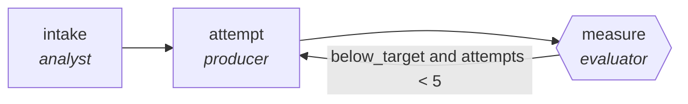

<!-- generated by scripts/gen_traces.py — edit graph.yaml / cases.yaml, then `uv run python scripts/gen_traces.py` -->
# 🔍 Trace gallery · `deploy-canary-verifier`

> Progressively shift traffic while checking error budgets.

2 golden case(s), 2/2 passing (`mock` runner, provisional).

## The graph

## Cases

### `meets-target-first-try` — ✅ passed

**Route** (3 step(s)): `intake` → `attempt` → `measure`

| # | Node | Output |
|---|---|---|
| 1 | `intake` | `summary='intake complete'` |
| 2 | `attempt` | `output={'error_rate': 0.05, 'threshold': 0.01, 'rollback_fired': True}` |
| 3 | `measure` | `below_target=False, attempts=1` |

**Verification checked:**

- ✅ `output.error_rate <= output.threshold or output.rollback_fired`

### `retry-then-meets-target` — ✅ passed

**Route** (5 step(s)): `intake` → `attempt` → `measure` → `attempt` → `measure`

| # | Node | Output |
|---|---|---|
| 1 | `intake` | `summary='intake complete'` |
| 2 | `attempt` | `output={'error_rate': 0.05, 'threshold': 0.01, 'rollback_fired': False}` |
| 3 | `measure` | `below_target=True, attempts=1` |
| 4 | `attempt` | `output={'error_rate': 0.05, 'threshold': 0.01, 'rollback_fired': True}` |
| 5 | `measure` | `below_target=False, attempts=2` |

**Verification checked:**

- ✅ `output.error_rate <= output.threshold or output.rollback_fired`

---
*Regenerate: `uv run python scripts/gen_traces.py` · [Trace gallery index](README.md) · [Graph card](../../graphs/devops-sre/deploy-canary-verifier/CARD.md)*
