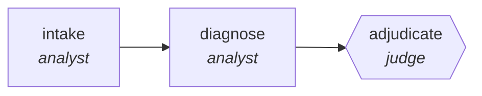

<!-- generated by scripts/gen_traces.py — edit graph.yaml / cases.yaml, then `uv run python scripts/gen_traces.py` -->
# 🔍 Trace gallery · `differential-diagnosis-ensemble`

> Independent diagnosticians rank hypotheses; a quorum decides and dissent is reported, never dropped.

1 golden case(s), 1/1 passing (`mock` runner, provisional).

## The graph

## Cases

### `happy-path` — ✅ passed

**Route** (3 step(s)): `intake` → `diagnose` → `adjudicate`

| # | Node | Output |
|---|---|---|
| 1 | `intake` | `presentations=[{'p': 1}, {'p': 2}, {'p': 3}]` |
| 2 | `diagnose` | `ranking='ranking-value'` |
| 3 | `adjudicate` | `consensus='dx-a', dissent=[{'dx': 'dx-b'}], output={'consensus': 'dx-a', 'dissent': [{'dx': 'dx-b'}], 'dissent_retained': True}` |

**Verification checked:**

- ✅ `output.consensus is not None or len(output.dissent) > 0`
- ✅ `output.dissent_retained == true`

---
*Regenerate: `uv run python scripts/gen_traces.py` · [Trace gallery index](README.md) · [Graph card](../../graphs/healthcare-science/differential-diagnosis-ensemble/CARD.md)*
