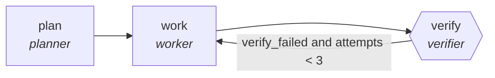

<!-- generated by scripts/gen_traces.py — edit graph.yaml / evals/<name>/cases.yaml, then `uv run python scripts/gen_traces.py` -->
# 🔍 Trace gallery · `docs-code-sync-audit`

> Extract every code example from the docs and execute it, recording the real exit code for each.

2 golden case(s), 2/2 passing (`mock` runner, provisional).

## The graph

## Cases

### `first-attempt-verified` — ✅ passed

**Route** (3 step(s)): `plan` → `work` → `verify`

| # | Node | Output |
|---|---|---|
| 1 | `plan` | `tasks=[{'doc': 'README.md', 'snippet': 'uv run agr list'}]` |
| 2 | `work` | `work_result={'doc': 'README.md', 'command': 'uv run agr list', 'exit_code': 0}` |
| 3 | `verify` | `verify_failed=False, attempts=1, output={'examples': [{'doc': 'README.md', 'exit_code': 0}]}, examples=[{'doc': 'README.md', 'exit_code': 0}]` |

**Verification checked:**

- ✅ `all(e.exit_code == 0 for e in output.examples)`

### `retry-then-verified` — ✅ passed

**Route** (5 step(s)): `plan` → `work` → `verify` → `work` → `verify`

| # | Node | Output |
|---|---|---|
| 1 | `plan` | `tasks=[{'doc': 'README.md', 'snippet': 'uv run agr list'}]` |
| 2 | `work` | `work_result={'doc': 'README.md', 'command': 'uv run agr list', 'exit_code': 0}` |
| 3 | `verify` | `verify_failed=True, attempts=1, examples=[{'doc': 'README.md', 'exit_code': 0}], output={'examples': [{'doc': 'README.md', 'exit_code': 0}]}` |
| 4 | `work` | `work_result={'doc': 'README.md', 'command': 'uv run agr list', 'exit_code': 0}` |
| 5 | `verify` | `verify_failed=False, attempts=2, output={'examples': [{'doc': 'README.md', 'exit_code': 0}]}, examples=[{'doc': 'README.md', 'exit_code': 0}]` |

**Verification checked:**

- ✅ `all(e.exit_code == 0 for e in output.examples)`

---
*Regenerate: `uv run python scripts/gen_traces.py` · [Trace gallery index](README.md) · [Graph card](../../graphs/software-engineering/docs-code-sync-audit/CARD.md)*
