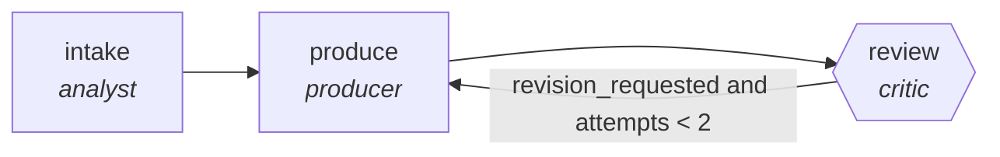

<!-- generated by scripts/gen_traces.py — edit graph.yaml / cases.yaml, then `uv run python scripts/gen_traces.py` -->
# 🔍 Trace gallery · `escalation-summarizer`

> Compress long threads into handoff briefs with state.

2 golden case(s), 2/2 passing (`mock` runner, provisional).

## The graph

## Cases

### `happy-path` — ✅ passed

**Route** (3 step(s)): `intake` → `produce` → `review`

| # | Node | Output |
|---|---|---|
| 1 | `intake` | `summary='intake complete'` |
| 2 | `produce` | `output={'asks': [{'text': 'refund status', 'quote': 'customer said ...'}], 'all_asks_covered': True}` |
| 3 | `review` | `revision_requested=False, attempts=1` |

**Verification checked:**

- ✅ `output.all_asks_covered and all(a.quote for a in output.asks)`

### `retry-then-resolved` — ✅ passed

**Route** (5 step(s)): `intake` → `produce` → `review` → `produce` → `review`

| # | Node | Output |
|---|---|---|
| 1 | `intake` | `summary='intake complete'` |
| 2 | `produce` | `output={'asks': [{'text': 'refund status', 'quote': ''}], 'all_asks_covered': False}` |
| 3 | `review` | `revision_requested=True, attempts=1` |
| 4 | `produce` | `output={'asks': [{'text': 'refund status', 'quote': 'customer said ...'}], 'all_asks_covered': True}` |
| 5 | `review` | `revision_requested=False, attempts=2` |

**Verification checked:**

- ✅ `output.all_asks_covered and all(a.quote for a in output.asks)`

---
*Regenerate: `uv run python scripts/gen_traces.py` · [Trace gallery index](README.md) · [Graph card](../../graphs/customer-support-sales/escalation-summarizer/CARD.md)*
