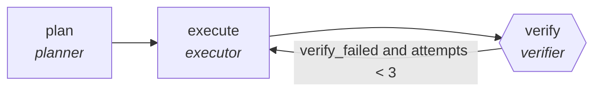

<!-- generated by scripts/gen_traces.py — edit graph.yaml / evals/<name>/cases.yaml, then `uv run python scripts/gen_traces.py` -->
# 🔍 Trace gallery · `etl-pipeline-builder`

> Design and build an ETL job from source to warehouse.

2 golden case(s), 2/2 passing (`mock` runner, provisional).

## The graph

## Cases

### `first-attempt-verified` — ✅ passed

**Route** (3 step(s)): `plan` → `execute` → `verify`

| # | Node | Output |
|---|---|---|
| 1 | `plan` | `steps=['decompose goal']` |
| 2 | `execute` | *(no fixture — empty output)* |
| 3 | `verify` | `verify_failed=False, attempts=1, output={'actual_rows': 10000, 'expected_rows': 10000}` |

**Verification checked:**

- ✅ `output.actual_rows == output.expected_rows`

### `retry-then-verified` — ✅ passed

**Route** (5 step(s)): `plan` → `execute` → `verify` → `execute` → `verify`

| # | Node | Output |
|---|---|---|
| 1 | `plan` | `steps=['decompose goal']` |
| 2 | `execute` | *(no fixture — empty output)* |
| 3 | `verify` | `verify_failed=True, attempts=1` |
| 4 | `execute` | *(no fixture — empty output)* |
| 5 | `verify` | `verify_failed=False, attempts=2, output={'actual_rows': 10000, 'expected_rows': 10000}` |

**Verification checked:**

- ✅ `output.actual_rows == output.expected_rows`

---
*Regenerate: `uv run python scripts/gen_traces.py` · [Trace gallery index](README.md) · [Graph card](../../graphs/data-analytics/etl-pipeline-builder/CARD.md)*
