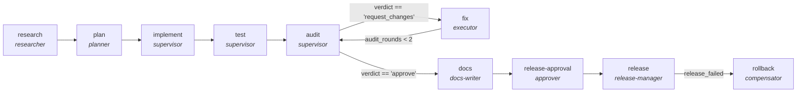

<!-- generated by scripts/gen_traces.py — edit graph.yaml / evals/<name>/cases.yaml, then `uv run python scripts/gen_traces.py` -->
# 🔍 Trace gallery · `feature-delivery-lifecycle`

> End-to-end feature delivery: research a problem, plan it, implement it, test it, audit the change, fix what the audit found, document it, and release behind a human gate with a rollback path. The implement, test and audit phases are not re-authored here — they reference the existing single-purpose graphs as subgraphs.

3 golden case(s), 3/3 passing (`mock` runner, provisional).

## The graph

## Cases

### `clean-path-releases` — ✅ passed

**Route** (14 step(s)): `research` → `plan` → `implement.plan` → `implement.execute` → `implement.verify` → `test.intake` → `test.generate` → `test.critique` → `audit.triage` → `audit.style-review` → `audit.synthesize` → `docs` → `release-approval` → `release`

| # | Node | Output |
|---|---|---|
| 1 | `research` | `research_brief='prior art reviewed', prior_art=[]` |
| 2 | `plan` | `plan=['slice a', 'slice b'], acceptance_criteria=['p95 < 200ms']` |
| 3 | `implement.plan` | `steps=['decompose goal']` |
| 4 | `implement.execute` | *(no fixture — empty output)* |
| 5 | `implement.verify` | `verify_failed=False, attempts=1, patch='diff --git a/app.py', output={'test_failed_before_patch': True, 'test_passes_after_patch': True}` |
| 6 | `test.intake` | *(no fixture — empty output)* |
| 7 | `test.generate` | *(no fixture — empty output)* |
| 8 | `test.critique` | `revision_requested=False, test_report={'passed': 12, 'failed': 0}, output={'coverage_delta': 4, 'mutation_score': 0.82, 'mutation_baseline': 0.6}` |
| 9 | `audit.triage` | `risk='low'` |
| 10 | `audit.style-review` | `style_findings=[]` |
| 11 | `audit.synthesize` | `verdict='approve', findings=[], output={'verdict': 'approve', 'findings': []}` |
| 12 | `docs` | `docs_updated=True` |
| 13 | `release-approval` | `signed_off=True` |
| 14 | `release` | `released=True, release_tag='v1.2.0', release_failed=False, output={'verdict': 'approve', 'docs_updated': True, 'signed_off': True, 'released': True, 'rolled_back': False}` |

**Verification checked:**

- ✅ `output.verdict == 'approve'`
- ✅ `output.docs_updated == true`
- ✅ `output.signed_off == true`
- ✅ `output.released == true or output.rolled_back == true`

### `audit-requests-changes-then-approves` — ✅ passed

**Route** (19 step(s)): `research` → `plan` → `implement.plan` → `implement.execute` → `implement.verify` → `test.intake` → `test.generate` → `test.critique` → `audit.triage` → `audit.security-review` → `audit.style-review` → `audit.synthesize` → `fix` → `audit.triage` → `audit.style-review` → `audit.synthesize` → `docs` → `release-approval` → `release`

| # | Node | Output |
|---|---|---|
| 1 | `research` | `research_brief='prior art reviewed', prior_art=[]` |
| 2 | `plan` | `plan=['slice a'], acceptance_criteria=['no regressions']` |
| 3 | `implement.plan` | `steps=['decompose goal']` |
| 4 | `implement.execute` | *(no fixture — empty output)* |
| 5 | `implement.verify` | `verify_failed=False, attempts=1, patch='diff v1', output={'test_failed_before_patch': True, 'test_passes_after_patch': True}` |
| 6 | `test.intake` | *(no fixture — empty output)* |
| 7 | `test.generate` | *(no fixture — empty output)* |
| 8 | `test.critique` | `revision_requested=False, test_report={'passed': 8, 'failed': 0}, output={'coverage_delta': 2, 'mutation_score': 0.75, 'mutation_baseline': 0.6}` |
| 9 | `audit.triage` | `risk='high'` |
| 10 | `audit.security-review` | `sec_hits=1` |
| 11 | `audit.style-review` | `style_findings=[]` |
| 12 | `audit.synthesize` | `verdict='request_changes', findings=[{'file': 'app.py', 'line': 42, 'note': 'hardcoded secret'}], output={'verdict': 'request_changes', 'findings': [{'file': 'app.py', 'line': 42, 'note': 'hardcoded secret'}]}` |
| 13 | `fix` | `patch='diff v2', audit_rounds=1` |
| 14 | `audit.triage` | `risk='low'` |
| 15 | `audit.style-review` | `style_findings=[]` |
| 16 | `audit.synthesize` | `verdict='approve', findings=[], output={'verdict': 'approve', 'findings': []}` |
| 17 | `docs` | `docs_updated=True` |
| 18 | `release-approval` | `signed_off=True` |
| 19 | `release` | `released=True, release_tag='v1.2.1', release_failed=False, output={'verdict': 'approve', 'docs_updated': True, 'signed_off': True, 'released': True, 'rolled_back': False}` |

**Verification checked:**

- ✅ `output.verdict == 'approve'`
- ✅ `output.docs_updated == true`
- ✅ `output.signed_off == true`
- ✅ `output.released == true or output.rolled_back == true`

### `failed-release-is-compensated` — ✅ passed

**Route** (15 step(s)): `research` → `plan` → `implement.plan` → `implement.execute` → `implement.verify` → `test.intake` → `test.generate` → `test.critique` → `audit.triage` → `audit.style-review` → `audit.synthesize` → `docs` → `release-approval` → `release` → `rollback`

| # | Node | Output |
|---|---|---|
| 1 | `research` | `research_brief='prior art reviewed', prior_art=[]` |
| 2 | `plan` | `plan=['slice a'], acceptance_criteria=['no regressions']` |
| 3 | `implement.plan` | `steps=['decompose goal']` |
| 4 | `implement.execute` | *(no fixture — empty output)* |
| 5 | `implement.verify` | `verify_failed=False, attempts=1, patch='diff v1', output={'test_failed_before_patch': True, 'test_passes_after_patch': True}` |
| 6 | `test.intake` | *(no fixture — empty output)* |
| 7 | `test.generate` | *(no fixture — empty output)* |
| 8 | `test.critique` | `revision_requested=False, test_report={'passed': 8, 'failed': 0}, output={'coverage_delta': 2, 'mutation_score': 0.75, 'mutation_baseline': 0.6}` |
| 9 | `audit.triage` | `risk='low'` |
| 10 | `audit.style-review` | `style_findings=[]` |
| 11 | `audit.synthesize` | `verdict='approve', findings=[], output={'verdict': 'approve', 'findings': []}` |
| 12 | `docs` | `docs_updated=True` |
| 13 | `release-approval` | `signed_off=True` |
| 14 | `release` | `released=False, release_tag='v1.2.2', release_failed=True` |
| 15 | `rollback` | `rolled_back=True, output={'verdict': 'approve', 'docs_updated': True, 'signed_off': True, 'released': False, 'rolled_back': True}` |

**Verification checked:**

- ✅ `output.verdict == 'approve'`
- ✅ `output.docs_updated == true`
- ✅ `output.signed_off == true`
- ✅ `output.released == true or output.rolled_back == true`

---
*Regenerate: `uv run python scripts/gen_traces.py` · [Trace gallery index](README.md) · [Graph card](../../graphs/software-engineering/feature-delivery-lifecycle/CARD.md)*
