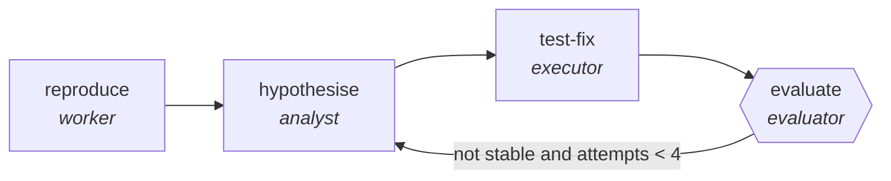

<!-- generated by scripts/gen_traces.py — edit graph.yaml / cases.yaml, then `uv run python scripts/gen_traces.py` -->
# 🔍 Trace gallery · `flaky-test-reflexion`

> Re-run a suspected flake, write down what was learned each time, and use it on the next attempt.

1 golden case(s), 1/1 passing (`mock` runner, provisional).

## The graph

## Cases

### `happy-path` — ✅ passed

**Route** (4 step(s)): `reproduce` → `hypothesise` → `test-fix` → `evaluate`

| # | Node | Output |
|---|---|---|
| 1 | `reproduce` | `observed='observed-value', seed='seed-value'` |
| 2 | `hypothesise` | `hypothesis='hypothesis-value'` |
| 3 | `test-fix` | `candidate_fix='candidate_fix-value'` |
| 4 | `evaluate` | `stable=True, lessons=[{'tried': 'seed pinning'}], output={'consecutive_green': 3, 'lessons': [{'tried': 'seed pinning'}]}` |

**Verification checked:**

- ✅ `output.consecutive_green >= 3`
- ✅ `len(output.lessons) >= 1`
- ⏭️ `pytest -q --count=5 {test_path}` — command checks are skipped by the mock runner (run with `--live` against a real environment to exercise them)

---
*Regenerate: `uv run python scripts/gen_traces.py` · [Trace gallery index](README.md) · [Graph card](../../graphs/software-engineering/flaky-test-reflexion/CARD.md)*
