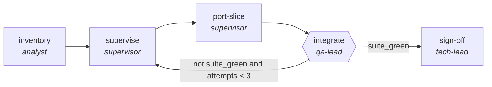

<!-- generated by scripts/gen_traces.py — edit graph.yaml / cases.yaml, then `uv run python scripts/gen_traces.py` -->
# 🔍 Trace gallery · `framework-migration`

> Port a codebase between frameworks in verifiable slices, each slice delegated to a refactor subgraph.

1 golden case(s), 1/1 passing (`mock` runner, provisional).

## The graph

## Cases

### `happy-path` — ✅ passed

**Route** (7 step(s)): `inventory` → `supervise` → `port-slice.intake` → `port-slice.produce` → `port-slice.review` → `integrate` → `sign-off`

| # | Node | Output |
|---|---|---|
| 1 | `inventory` | `slices=[], risk_map=[]` |
| 2 | `supervise` | `slice_queue=[]` |
| 3 | `port-slice.intake` | `summary='intake complete'` |
| 4 | `port-slice.produce` | `output={'snapshot_before': 'hash-abc123', 'snapshot_after': 'hash-abc123'}` |
| 5 | `port-slice.review` | `slice_ported=True, revision_requested=False, attempts=1` |
| 6 | `integrate` | `suite_green=True, ported_slices=3, output={}` |
| 7 | `sign-off` | `migration_complete='migration_complete-value', output={'suite_green': True, 'slices_remaining': 0}` |

**Verification checked:**

- ⏭️ `pytest -q` — command checks are skipped by the mock runner (run with `--live` against a real environment to exercise them)
- ✅ `output.slices_remaining == 0`

---
*Regenerate: `uv run python scripts/gen_traces.py` · [Trace gallery index](README.md) · [Graph card](../../graphs/software-engineering/framework-migration/CARD.md)*
