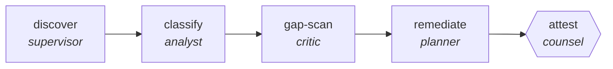

<!-- generated by scripts/gen_traces.py — edit graph.yaml / cases.yaml, then `uv run python scripts/gen_traces.py` -->
# 🔍 Trace gallery · `gdpr-data-audit`

> Map personal data across systems, classify lawful basis, find gaps, and produce a remediation plan.

1 golden case(s), 1/1 passing (`mock` runner, provisional).

## The graph

## Cases

### `happy-path` — ✅ passed

**Route** (7 step(s)): `discover.plan` → `discover.work` → `discover.verify` → `classify` → `gap-scan` → `remediate` → `attest`

| # | Node | Output |
|---|---|---|
| 1 | `discover.plan` | `steps=['decompose goal']` |
| 2 | `discover.work` | *(no fixture — empty output)* |
| 3 | `discover.verify` | `data_map=[], verify_failed=False, attempts=1, output={'violations': [{'rule_id': 'null-check', 'count': 3}]}` |
| 4 | `classify` | `lawful_basis=[]` |
| 5 | `gap-scan` | `gaps=[{'owner': 'dpo', 'due': '2026-09-01'}]` |
| 6 | `remediate` | `remediation_plan='remediation_plan-value'` |
| 7 | `attest` | `attested=True, output={'unclassified_stores': 0, 'gaps': [{'owner': 'dpo', 'due': '2026-09-01'}], 'attested': True}` |

**Verification checked:**

- ✅ `output.unclassified_stores == 0`
- ✅ `all(gp.owner and gp.due for gp in output.gaps)`

---
*Regenerate: `uv run python scripts/gen_traces.py` · [Trace gallery index](README.md) · [Graph card](../../graphs/legal-compliance/gdpr-data-audit/CARD.md)*
