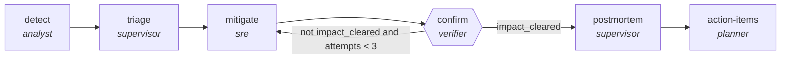

<!-- generated by scripts/gen_traces.py — edit graph.yaml / evals/<name>/cases.yaml, then `uv run python scripts/gen_traces.py` -->
# 🔍 Trace gallery · `incident-lifecycle`

> Detect, triage, mitigate and prove an incident closed, then write the postmortem and file the actions.

1 golden case(s), 1/1 passing (`mock` runner, provisional).

## The graph

## Cases

### `happy-path` — ✅ passed

**Route** (10 step(s)): `detect` → `triage.route` → `triage.branch-simple` → `triage.verify` → `mitigate` → `confirm` → `postmortem.intake` → `postmortem.produce` → `postmortem.review` → `action-items`

| # | Node | Output |
|---|---|---|
| 1 | `detect` | `signal='signal-value', blast_radius=[]` |
| 2 | `triage.route` | `complexity='simple', risk='low', revision_requested=False, rejected=False, verify_failed=False, below_target=False, attempts=1` |
| 3 | `triage.branch-simple` | *(no fixture — empty output)* |
| 4 | `triage.verify` | `owner='owner-value', severity='severity-value'` |
| 5 | `mitigate` | `mitigation='mitigation-value', mitigated=True` |
| 6 | `confirm` | `impact_cleared=True` |
| 7 | `postmortem.intake` | `complexity='simple', risk='low', revision_requested=False, rejected=False, verify_failed=False, below_target=False, attempts=1` |
| 8 | `postmortem.produce` | *(no fixture — empty output)* |
| 9 | `postmortem.review` | `postmortem='postmortem-value'` |
| 10 | `action-items` | `actions=[{'owner': 'sre', 'task': 'add alert'}], output={'impact_cleared': True, 'actions': [{'owner': 'sre', 'task': 'add alert'}]}` |

**Verification checked:**

- ✅ `output.impact_cleared == true`
- ✅ `len(output.actions) >= 1`

---
*Regenerate: `uv run python scripts/gen_traces.py` · [Trace gallery index](README.md) · [Graph card](../../graphs/devops-sre/incident-lifecycle/CARD.md)*
