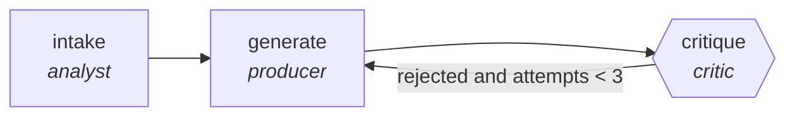

<!-- generated by scripts/gen_traces.py — edit graph.yaml / cases.yaml, then `uv run python scripts/gen_traces.py` -->
# 🔍 Trace gallery · `jd-drafting-critic`

> Draft job descriptions, critic removes bias and inflation.

2 golden case(s), 2/2 passing (`mock` runner, provisional).

## The graph

## Cases

### `generated-and-approved` — ✅ passed

**Route** (3 step(s)): `intake` → `generate` → `critique`

| # | Node | Output |
|---|---|---|
| 1 | `intake` | `summary='intake complete'` |
| 2 | `generate` | `draft='v1'` |
| 3 | `critique` | `rejected=False, attempts=1, output={'bias_lint_clean': True, 'requirements_deduped': True}` |

**Verification checked:**

- ✅ `output.bias_lint_clean and output.requirements_deduped`

### `revised-after-rejection` — ✅ passed

**Route** (5 step(s)): `intake` → `generate` → `critique` → `generate` → `critique`

| # | Node | Output |
|---|---|---|
| 1 | `intake` | `summary='intake complete'` |
| 2 | `generate` | `draft='v1'` |
| 3 | `critique` | `rejected=True, attempts=1` |
| 4 | `generate` | `draft='v2'` |
| 5 | `critique` | `rejected=False, attempts=2, output={'bias_lint_clean': True, 'requirements_deduped': True}` |

**Verification checked:**

- ✅ `output.bias_lint_clean and output.requirements_deduped`

---
*Regenerate: `uv run python scripts/gen_traces.py` · [Trace gallery index](README.md) · [Graph card](../../graphs/hr-people/jd-drafting-critic/CARD.md)*
