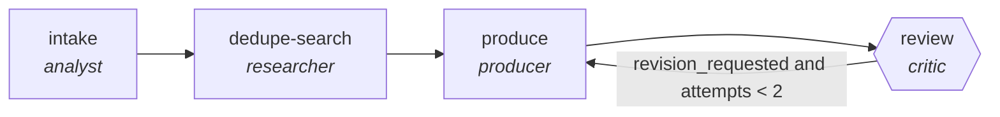

<!-- generated by scripts/gen_traces.py — edit graph.yaml / cases.yaml, then `uv run python scripts/gen_traces.py` -->
# 🔍 Trace gallery · `kb-article-generator`

> Mine resolved tickets into draft knowledge-base articles.

2 golden case(s), 2/2 passing (`mock` runner, provisional).

## The graph

## Cases

### `happy-path` — ✅ passed

**Route** (4 step(s)): `intake` → `dedupe-search` → `produce` → `review`

| # | Node | Output |
|---|---|---|
| 1 | `intake` | `summary='intake complete'` |
| 2 | `dedupe-search` | `existing_articles=[]` |
| 3 | `produce` | `output={'steps': ['restart service', 'clear cache'], 'reproduces_resolution': True, 'duplicates_deduped': True}, steps=[{'action': 'clear cache', 'expected': 'login succeeds'}], near_duplicates=[]` |
| 4 | `review` | `revision_requested=False, attempts=1, steps=[{'action': 'clear cache', 'expected': 'login succeeds'}], near_duplicates=[], output={'steps': [{'action': 'clear cache', 'expected': 'login succeeds'}], 'near_duplicates': []}` |

**Verification checked:**

- ✅ `all(s.action and s.expected for s in output.steps)`
- ✅ `len(output.near_duplicates) == 0`

### `retry-then-resolved` — ✅ passed

**Route** (6 step(s)): `intake` → `dedupe-search` → `produce` → `review` → `produce` → `review`

| # | Node | Output |
|---|---|---|
| 1 | `intake` | `summary='intake complete'` |
| 2 | `dedupe-search` | `existing_articles=[]` |
| 3 | `produce` | `output={'steps': [], 'reproduces_resolution': False, 'duplicates_deduped': False}, steps=[{'action': 'clear cache', 'expected': 'login succeeds'}], near_duplicates=[]` |
| 4 | `review` | `revision_requested=True, attempts=1, steps=[{'action': 'clear cache', 'expected': 'login succeeds'}], near_duplicates=[], output={'steps': [{'action': 'clear cache', 'expected': 'login succeeds'}], 'near_duplicates': []}` |
| 5 | `produce` | `output={'steps': ['restart service', 'clear cache'], 'reproduces_resolution': True, 'duplicates_deduped': True}, steps=[{'action': 'clear cache', 'expected': 'login succeeds'}], near_duplicates=[]` |
| 6 | `review` | `revision_requested=False, attempts=2, steps=[{'action': 'clear cache', 'expected': 'login succeeds'}], near_duplicates=[], output={'steps': [{'action': 'clear cache', 'expected': 'login succeeds'}], 'near_duplicates': []}` |

**Verification checked:**

- ✅ `all(s.action and s.expected for s in output.steps)`
- ✅ `len(output.near_duplicates) == 0`

---
*Regenerate: `uv run python scripts/gen_traces.py` · [Trace gallery index](README.md) · [Graph card](../../graphs/customer-support-sales/kb-article-generator/CARD.md)*
