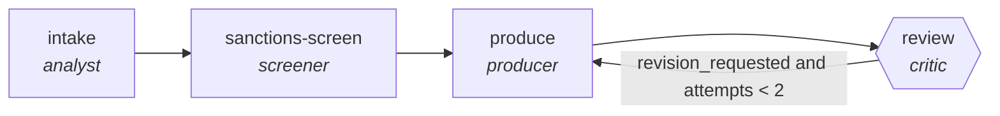

<!-- generated by scripts/gen_traces.py — edit graph.yaml / cases.yaml, then `uv run python scripts/gen_traces.py` -->
# 🔍 Trace gallery · `kyc-document-processing`

> Extract, cross-check, and flag gaps in KYC documents.

2 golden case(s), 2/2 passing (`mock` runner, provisional).

## The graph

## Cases

### `happy-path` — ✅ passed

**Route** (4 step(s)): `intake` → `sanctions-screen` → `produce` → `review`

| # | Node | Output |
|---|---|---|
| 1 | `intake` | `summary='intake complete'` |
| 2 | `sanctions-screen` | `screen_hits=[]` |
| 3 | `produce` | `output={'fields': [{'name': 'date_of_birth', 'value': '1990-01-01', 'validated': True}]}` |
| 4 | `review` | `revision_requested=False, attempts=1` |

**Verification checked:**

- ✅ `all(f.validated for f in output.fields)`

### `retry-then-resolved` — ✅ passed

**Route** (6 step(s)): `intake` → `sanctions-screen` → `produce` → `review` → `produce` → `review`

| # | Node | Output |
|---|---|---|
| 1 | `intake` | `summary='intake complete'` |
| 2 | `sanctions-screen` | `screen_hits=[]` |
| 3 | `produce` | `output={'fields': [{'name': 'date_of_birth', 'value': '1990-01-01', 'validated': False}]}` |
| 4 | `review` | `revision_requested=True, attempts=1` |
| 5 | `produce` | `output={'fields': [{'name': 'date_of_birth', 'value': '1990-01-01', 'validated': True}]}` |
| 6 | `review` | `revision_requested=False, attempts=2` |

**Verification checked:**

- ✅ `all(f.validated for f in output.fields)`

---
*Regenerate: `uv run python scripts/gen_traces.py` · [Trace gallery index](README.md) · [Graph card](../../graphs/finance/kyc-document-processing/CARD.md)*
