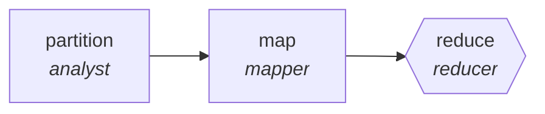

<!-- generated by scripts/gen_traces.py — edit graph.yaml / evals/<name>/cases.yaml, then `uv run python scripts/gen_traces.py` -->
# 🔍 Trace gallery · `license-compliance-scan`

> Scan dependency licenses, reduce to obligations report.

2 golden case(s), 2/2 passing (`mock` runner, provisional).

## The graph

## Cases

### `single-item` — ✅ passed

**Route** (3 step(s)): `partition` → `map` → `reduce`

| # | Node | Output |
|---|---|---|
| 1 | `partition` | `shard_count=1, shards=[{'i': 1}, {'i': 2}, {'i': 3}]` |
| 2 | `map` | `shard_result=[{'id': 1, 'finding': 'ok'}]` |
| 3 | `reduce` | `output={'packages': [{'name': 'foo', 'spdx': 'MIT'}], 'copyleft_conflicts': []}` |

**Verification checked:**

- ✅ `all(p.spdx for p in output.packages) and not output.copyleft_conflicts`

### `multi-item` — ✅ passed

**Route** (3 step(s)): `partition` → `map` → `reduce`

| # | Node | Output |
|---|---|---|
| 1 | `partition` | `shard_count=2, shards=[{'i': 1}, {'i': 2}, {'i': 3}]` |
| 2 | `map` | `shard_result=[{'id': 1, 'finding': 'ok'}]` |
| 3 | `reduce` | `output={'packages': [{'name': 'foo', 'spdx': 'MIT'}, {'name': 'bar', 'spdx': 'GPL-3.0'}], 'copyleft_conflicts': []}` |

**Verification checked:**

- ✅ `all(p.spdx for p in output.packages) and not output.copyleft_conflicts`

---
*Regenerate: `uv run python scripts/gen_traces.py` · [Trace gallery index](README.md) · [Graph card](../../graphs/legal-compliance/license-compliance-scan/CARD.md)*
