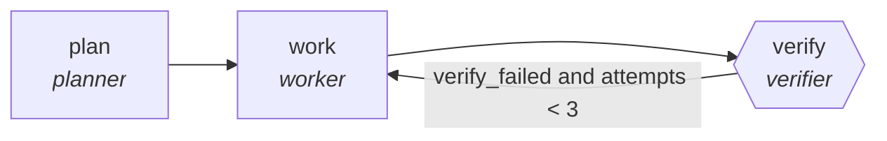

<!-- generated by scripts/gen_traces.py — edit graph.yaml / evals/<name>/cases.yaml, then `uv run python scripts/gen_traces.py` -->
# 🔍 Trace gallery · `literature-review-swarm`

> Parallel readers summarize papers, merger builds themed review.

2 golden case(s), 2/2 passing (`mock` runner, provisional).

## The graph

## Cases

### `first-attempt-verified` — ✅ passed

**Route** (3 step(s)): `plan` → `work` → `verify`

| # | Node | Output |
|---|---|---|
| 1 | `plan` | `steps=['decompose goal']` |
| 2 | `work` | *(no fixture — empty output)* |
| 3 | `verify` | `verify_failed=False, attempts=1, output={'claims': [{'text': 'effect size is moderate', 'paper': 'Smith2024', 'section': '3.2'}]}` |

**Verification checked:**

- ✅ `all(c.paper and c.section for c in output.claims)`

### `retry-then-verified` — ✅ passed

**Route** (5 step(s)): `plan` → `work` → `verify` → `work` → `verify`

| # | Node | Output |
|---|---|---|
| 1 | `plan` | `steps=['decompose goal']` |
| 2 | `work` | *(no fixture — empty output)* |
| 3 | `verify` | `verify_failed=True, attempts=1` |
| 4 | `work` | *(no fixture — empty output)* |
| 5 | `verify` | `verify_failed=False, attempts=2, output={'claims': [{'text': 'effect size is moderate', 'paper': 'Smith2024', 'section': '3.2'}]}` |

**Verification checked:**

- ✅ `all(c.paper and c.section for c in output.claims)`

---
*Regenerate: `uv run python scripts/gen_traces.py` · [Trace gallery index](README.md) · [Graph card](../../graphs/research-knowledge/literature-review-swarm/CARD.md)*
