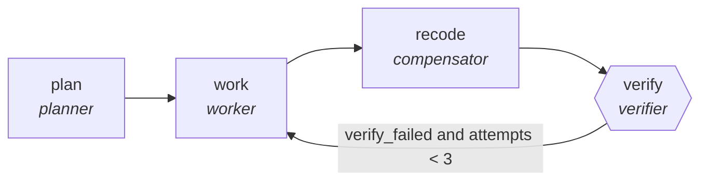

<!-- generated by scripts/gen_traces.py — edit graph.yaml / cases.yaml, then `uv run python scripts/gen_traces.py` -->
# 🔍 Trace gallery · `medical-coding-audit`

> Workers verify diagnosis and procedure codes against notes.

2 golden case(s), 2/2 passing (`mock` runner, provisional).

## The graph

## Cases

### `first-attempt-verified` — ✅ passed

**Route** (4 step(s)): `plan` → `work` → `recode` → `verify`

| # | Node | Output |
|---|---|---|
| 1 | `plan` | `steps=['decompose goal'], tasks=[{'i': 1}, {'i': 2}, {'i': 3}]` |
| 2 | `work` | `work_result=[{'id': 1, 'status': 'done'}]` |
| 3 | `recode` | `corrections=[{'from': 'J18.9', 'to': 'J15.9'}]` |
| 4 | `verify` | `verify_failed=False, attempts=1, output={'codes': [{'code': 'J45.909', 'note_span': 'pt has asthma, wheezing on exam'}]}` |

**Verification checked:**

- ✅ `all(c.note_span for c in output.codes)`

### `retry-then-verified` — ✅ passed

**Route** (7 step(s)): `plan` → `work` → `recode` → `verify` → `work` → `recode` → `verify`

| # | Node | Output |
|---|---|---|
| 1 | `plan` | `steps=['decompose goal'], tasks=[{'i': 1}, {'i': 2}, {'i': 3}]` |
| 2 | `work` | `work_result=[{'id': 1, 'status': 'done'}]` |
| 3 | `recode` | `corrections=[{'from': 'J18.9', 'to': 'J15.9'}]` |
| 4 | `verify` | `verify_failed=True, attempts=1` |
| 5 | `work` | `work_result=[{'id': 1, 'status': 'done'}]` |
| 6 | `recode` | `corrections=[{'from': 'J18.9', 'to': 'J15.9'}]` |
| 7 | `verify` | `verify_failed=False, attempts=2, output={'codes': [{'code': 'J45.909', 'note_span': 'pt has asthma, wheezing on exam'}]}` |

**Verification checked:**

- ✅ `all(c.note_span for c in output.codes)`

---
*Regenerate: `uv run python scripts/gen_traces.py` · [Trace gallery index](README.md) · [Graph card](../../graphs/healthcare-science/medical-coding-audit/CARD.md)*
