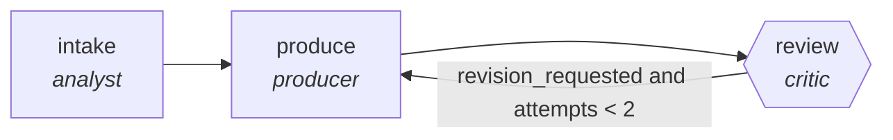

<!-- generated by scripts/gen_traces.py — edit graph.yaml / cases.yaml, then `uv run python scripts/gen_traces.py` -->
# 🔍 Trace gallery · `meeting-to-actions`

> Transcript to decisions, owners, deadlines, and follow-ups.

2 golden case(s), 2/2 passing (`mock` runner, provisional).

## The graph

## Cases

### `happy-path` — ✅ passed

**Route** (3 step(s)): `intake` → `produce` → `review`

| # | Node | Output |
|---|---|---|
| 1 | `intake` | `summary='intake complete'` |
| 2 | `produce` | `output={'actions': [{'owner': 'Alice', 'date': '2026-08-01', 'quote': 'will do X'}]}` |
| 3 | `review` | `revision_requested=False, attempts=1` |

**Verification checked:**

- ✅ `all(a.owner and a.date and a.quote for a in output.actions)`

### `retry-then-resolved` — ✅ passed

**Route** (5 step(s)): `intake` → `produce` → `review` → `produce` → `review`

| # | Node | Output |
|---|---|---|
| 1 | `intake` | `summary='intake complete'` |
| 2 | `produce` | `output={'actions': [{'owner': '', 'date': '', 'quote': ''}]}` |
| 3 | `review` | `revision_requested=True, attempts=1` |
| 4 | `produce` | `output={'actions': [{'owner': 'Alice', 'date': '2026-08-01', 'quote': 'will do X'}]}` |
| 5 | `review` | `revision_requested=False, attempts=2` |

**Verification checked:**

- ✅ `all(a.owner and a.date and a.quote for a in output.actions)`

---
*Regenerate: `uv run python scripts/gen_traces.py` · [Trace gallery index](README.md) · [Graph card](../../graphs/business-ops/meeting-to-actions/CARD.md)*
