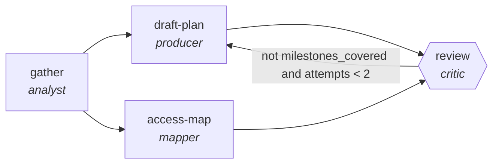

<!-- generated by scripts/gen_traces.py — edit graph.yaml / cases.yaml, then `uv run python scripts/gen_traces.py` -->
# 🔍 Trace gallery · `onboarding-plan-builder`

> Build a role-specific 30/60/90 plan from the JD, team context and access requirements, then verify coverage.

1 golden case(s), 1/1 passing (`mock` runner, provisional).

## The graph

## Cases

### `happy-path` — ✅ passed

**Route** (4 step(s)): `gather` → `draft-plan` → `access-map` → `review`

| # | Node | Output |
|---|---|---|
| 1 | `gather` | `role_context='role_context-value'` |
| 2 | `draft-plan` | `plan_30_60_90='plan_30_60_90-value'` |
| 3 | `access-map` | `access_requests=[]` |
| 4 | `review` | `milestones_covered=True, output={'milestones_covered': True, 'access_requested': True}` |

**Verification checked:**

- ✅ `output.milestones_covered == true`
- ✅ `output.access_requested == true`

---
*Regenerate: `uv run python scripts/gen_traces.py` · [Trace gallery index](README.md) · [Graph card](../../graphs/hr-people/onboarding-plan-builder/CARD.md)*
