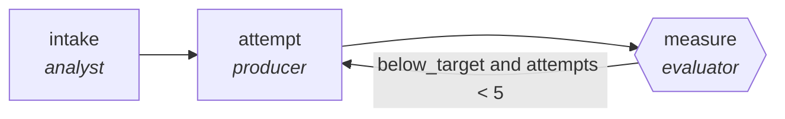

<!-- generated by scripts/gen_traces.py — edit graph.yaml / cases.yaml, then `uv run python scripts/gen_traces.py` -->
# 🔍 Trace gallery · `performance-optimization`

> Profile, patch hotspot, re-benchmark until budget met.

2 golden case(s), 2/2 passing (`mock` runner, provisional).

## The graph

## Cases

### `meets-target-first-try` — ✅ passed

**Route** (3 step(s)): `intake` → `attempt` → `measure`

| # | Node | Output |
|---|---|---|
| 1 | `intake` | `summary='intake complete'` |
| 2 | `attempt` | `output={'benchmark_ms': 120, 'target_ms': 150, 'test_regressions': []}` |
| 3 | `measure` | `below_target=False, attempts=1` |

**Verification checked:**

- ✅ `output.benchmark_ms <= output.target_ms and not output.test_regressions`
- ⏭️ `pytest -q --benchmark-only` — command checks are skipped by the mock runner (run with `--live` against a real environment to exercise them)

### `retry-then-meets-target` — ✅ passed

**Route** (5 step(s)): `intake` → `attempt` → `measure` → `attempt` → `measure`

| # | Node | Output |
|---|---|---|
| 1 | `intake` | `summary='intake complete'` |
| 2 | `attempt` | `output={'benchmark_ms': 200, 'target_ms': 150, 'test_regressions': []}` |
| 3 | `measure` | `below_target=True, attempts=1` |
| 4 | `attempt` | `output={'benchmark_ms': 120, 'target_ms': 150, 'test_regressions': []}` |
| 5 | `measure` | `below_target=False, attempts=2` |

**Verification checked:**

- ✅ `output.benchmark_ms <= output.target_ms and not output.test_regressions`
- ⏭️ `pytest -q --benchmark-only` — command checks are skipped by the mock runner (run with `--live` against a real environment to exercise them)

---
*Regenerate: `uv run python scripts/gen_traces.py` · [Trace gallery index](README.md) · [Graph card](../../graphs/software-engineering/performance-optimization/CARD.md)*
