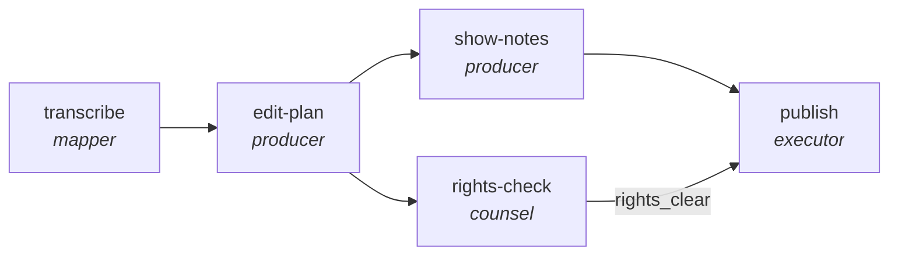

<!-- generated by scripts/gen_traces.py — edit graph.yaml / evals/<name>/cases.yaml, then `uv run python scripts/gen_traces.py` -->
# 🔍 Trace gallery · `podcast-production-pipeline`

> Turn a raw recording into a published episode: transcript, edit plan, show notes, rights check, publish.

1 golden case(s), 1/1 passing (`mock` runner, provisional).

## The graph

## Cases

### `happy-path` — ✅ passed

**Route** (5 step(s)): `transcribe` → `edit-plan` → `show-notes` → `rights-check` → `publish`

| # | Node | Output |
|---|---|---|
| 1 | `transcribe` | `transcript='transcript-value'` |
| 2 | `edit-plan` | `cut_list=[]` |
| 3 | `show-notes` | `show_notes=[], timestamps=[]` |
| 4 | `rights-check` | `clearances=[], rights_clear=True` |
| 5 | `publish` | `published=True, output={'rights_clear': True, 'timestamps_valid': True, 'published': True}` |

**Verification checked:**

- ✅ `output.rights_clear == true`
- ✅ `output.timestamps_valid == true`

---
*Regenerate: `uv run python scripts/gen_traces.py` · [Trace gallery index](README.md) · [Graph card](../../graphs/creative-production/podcast-production-pipeline/CARD.md)*
