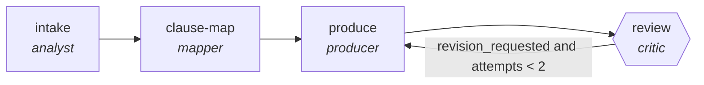

<!-- generated by scripts/gen_traces.py — edit graph.yaml / cases.yaml, then `uv run python scripts/gen_traces.py` -->
# 🔍 Trace gallery · `policy-compliance-check`

> Check internal docs and processes against a policy set.

2 golden case(s), 2/2 passing (`mock` runner, provisional).

## The graph

## Cases

### `happy-path` — ✅ passed

**Route** (4 step(s)): `intake` → `clause-map` → `produce` → `review`

| # | Node | Output |
|---|---|---|
| 1 | `intake` | `summary='intake complete'` |
| 2 | `clause-map` | `clause_shards=[{'clause_id': 'C-1', 'spans': ['s1']}]` |
| 3 | `produce` | `output={'findings': [{'issue': 'missing encryption at rest', 'clause_id': 'POL-3.2'}]}` |
| 4 | `review` | `revision_requested=False, attempts=1` |

**Verification checked:**

- ✅ `all(f.clause_id for f in output.findings)`

### `retry-then-resolved` — ✅ passed

**Route** (6 step(s)): `intake` → `clause-map` → `produce` → `review` → `produce` → `review`

| # | Node | Output |
|---|---|---|
| 1 | `intake` | `summary='intake complete'` |
| 2 | `clause-map` | `clause_shards=[{'clause_id': 'C-1', 'spans': ['s1']}]` |
| 3 | `produce` | `output={'findings': [{'issue': 'missing encryption at rest', 'clause_id': ''}]}` |
| 4 | `review` | `revision_requested=True, attempts=1` |
| 5 | `produce` | `output={'findings': [{'issue': 'missing encryption at rest', 'clause_id': 'POL-3.2'}]}` |
| 6 | `review` | `revision_requested=False, attempts=2` |

**Verification checked:**

- ✅ `all(f.clause_id for f in output.findings)`

---
*Regenerate: `uv run python scripts/gen_traces.py` · [Trace gallery index](README.md) · [Graph card](../../graphs/business-ops/policy-compliance-check/CARD.md)*
