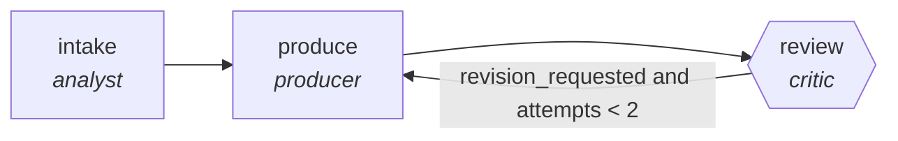

<!-- generated by scripts/gen_traces.py — edit graph.yaml / evals/<name>/cases.yaml, then `uv run python scripts/gen_traces.py` -->
# 🔍 Trace gallery · `postmortem-writer`

> Assemble timeline from logs and chat, draft blameless postmortem.

2 golden case(s), 2/2 passing (`mock` runner, provisional).

## The graph

## Cases

### `happy-path` — ✅ passed

**Route** (3 step(s)): `intake` → `produce` → `review`

| # | Node | Output |
|---|---|---|
| 1 | `intake` | `summary='intake complete'` |
| 2 | `produce` | `output={'timeline': [{'event': 'alert fired', 'log_id': 'L-1'}, {'event': 'paged on-call', 'message_id': 'M-2'}]}` |
| 3 | `review` | `revision_requested=False, attempts=1` |

**Verification checked:**

- ✅ `all(e.get('log_id') or e.get('message_id') for e in output.timeline)`

### `retry-then-resolved` — ✅ passed

**Route** (5 step(s)): `intake` → `produce` → `review` → `produce` → `review`

| # | Node | Output |
|---|---|---|
| 1 | `intake` | `summary='intake complete'` |
| 2 | `produce` | `output={'timeline': [{'event': 'alert fired'}]}` |
| 3 | `review` | `revision_requested=True, attempts=1` |
| 4 | `produce` | `output={'timeline': [{'event': 'alert fired', 'log_id': 'L-1'}, {'event': 'paged on-call', 'message_id': 'M-2'}]}` |
| 5 | `review` | `revision_requested=False, attempts=2` |

**Verification checked:**

- ✅ `all(e.get('log_id') or e.get('message_id') for e in output.timeline)`

---
*Regenerate: `uv run python scripts/gen_traces.py` · [Trace gallery index](README.md) · [Graph card](../../graphs/devops-sre/postmortem-writer/CARD.md)*
