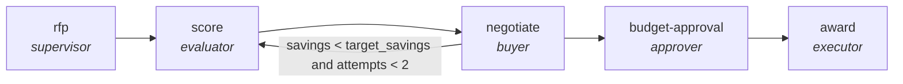

<!-- generated by scripts/gen_traces.py — edit graph.yaml / evals/<name>/cases.yaml, then `uv run python scripts/gen_traces.py` -->
# 🔍 Trace gallery · `procurement-lifecycle`

> Run an RFP, score vendors, negotiate terms, and gate the award on budget-holder approval.

1 golden case(s), 1/1 passing (`mock` runner, provisional).

## The graph

## Cases

### `happy-path` — ✅ passed

**Route** (7 step(s)): `rfp.partition` → `rfp.map` → `rfp.reduce` → `score` → `negotiate` → `budget-approval` → `award`

| # | Node | Output |
|---|---|---|
| 1 | `rfp.partition` | `shard_count=1` |
| 2 | `rfp.map` | *(no fixture — empty output)* |
| 3 | `rfp.reduce` | `rfp_responses=[], output={'requirements': [{'id': 'R1', 'answered': True, 'flagged': False}, {'id': 'R2', 'answered': False, 'flagged': True}], 'page_count': 8, 'page_limit': 10}` |
| 4 | `score` | `vendor_scores=[]` |
| 5 | `negotiate` | `terms=[], savings=[]` |
| 6 | `budget-approval` | `signed_off=True` |
| 7 | `award` | `awarded=True, scored_vendors=3, output={'scored_vendors': 3, 'signed_off': True, 'awarded': True}` |

**Verification checked:**

- ✅ `output.scored_vendors >= 3`
- ✅ `output.signed_off == true`

---
*Regenerate: `uv run python scripts/gen_traces.py` · [Trace gallery index](README.md) · [Graph card](../../graphs/business-ops/procurement-lifecycle/CARD.md)*
