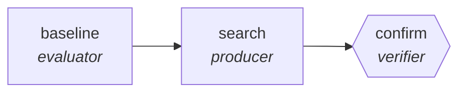

<!-- generated by scripts/gen_traces.py — edit graph.yaml / evals/<name>/cases.yaml, then `uv run python scripts/gen_traces.py` -->
# 🔍 Trace gallery · `prompt-graph-optimization`

> Search prompt-and-topology variants against a held-out eval set, keeping only measured winners.

1 golden case(s), 1/1 passing (`mock` runner, provisional).

## The graph

## Cases

### `happy-path` — ✅ passed

**Route** (3 step(s)): `baseline` → `search` → `confirm`

| # | Node | Output |
|---|---|---|
| 1 | `baseline` | `baseline_score=0.72, eval_set='eval_set-value'` |
| 2 | `search` | `variant='variant-value', score=0.81` |
| 3 | `confirm` | `holdout_score=0.81, output={'holdout_score': 0.81, 'baseline_score': 0.72}` |

**Verification checked:**

- ✅ `output.holdout_score > output.baseline_score`

---
*Regenerate: `uv run python scripts/gen_traces.py` · [Trace gallery index](README.md) · [Graph card](../../graphs/research-knowledge/prompt-graph-optimization/CARD.md)*
