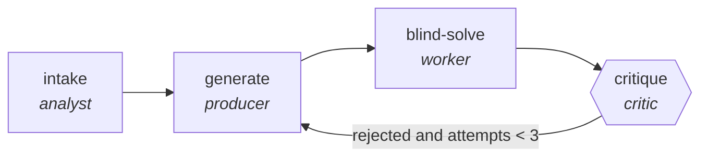

<!-- generated by scripts/gen_traces.py — edit graph.yaml / cases.yaml, then `uv run python scripts/gen_traces.py` -->
# 🔍 Trace gallery · `quiz-generation-verified`

> Generate items, critic solves them blind to verify keys.

2 golden case(s), 2/2 passing (`mock` runner, provisional).

## The graph

## Cases

### `generated-and-approved` — ✅ passed

**Route** (4 step(s)): `intake` → `generate` → `blind-solve` → `critique`

| # | Node | Output |
|---|---|---|
| 1 | `intake` | `summary='intake complete'` |
| 2 | `generate` | `draft='v1'` |
| 3 | `blind-solve` | `blind_answers=[{'item': 1, 'answer': 'b'}]` |
| 4 | `critique` | `rejected=False, attempts=1, output={'entries': [{'answer_matches_key': True, 'distractors_plausible': True}]}` |

**Verification checked:**

- ✅ `all(i.answer_matches_key and i.distractors_plausible for i in output.entries)`

### `revised-after-rejection` — ✅ passed

**Route** (7 step(s)): `intake` → `generate` → `blind-solve` → `critique` → `generate` → `blind-solve` → `critique`

| # | Node | Output |
|---|---|---|
| 1 | `intake` | `summary='intake complete'` |
| 2 | `generate` | `draft='v1'` |
| 3 | `blind-solve` | `blind_answers=[{'item': 1, 'answer': 'b'}]` |
| 4 | `critique` | `rejected=True, attempts=1` |
| 5 | `generate` | `draft='v2'` |
| 6 | `blind-solve` | `blind_answers=[{'item': 1, 'answer': 'b'}]` |
| 7 | `critique` | `rejected=False, attempts=2, output={'entries': [{'answer_matches_key': True, 'distractors_plausible': True}]}` |

**Verification checked:**

- ✅ `all(i.answer_matches_key and i.distractors_plausible for i in output.entries)`

---
*Regenerate: `uv run python scripts/gen_traces.py` · [Trace gallery index](README.md) · [Graph card](../../graphs/education/quiz-generation-verified/CARD.md)*
