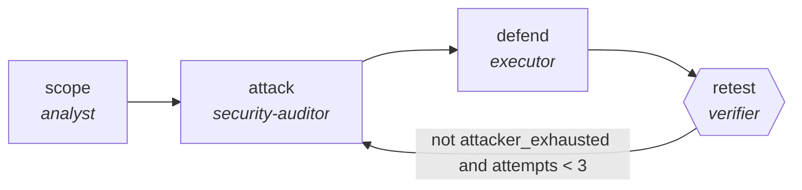

<!-- generated by scripts/gen_traces.py — edit graph.yaml / cases.yaml, then `uv run python scripts/gen_traces.py` -->
# 🔍 Trace gallery · `red-team-blue-team-hardening`

> An attacker searches for a working bypass while a defender patches, until the attacker is exhausted.

1 golden case(s), 1/1 passing (`mock` runner, provisional).

## The graph

## Cases

### `happy-path` — ✅ passed

**Route** (4 step(s)): `scope` → `attack` → `defend` → `retest`

| # | Node | Output |
|---|---|---|
| 1 | `scope` | `surface='surface-value', rules_of_engagement='rules_of_engagement-value'` |
| 2 | `attack` | `bypass='bypass-value', severity=2` |
| 3 | `defend` | `mitigation='mitigation-value'` |
| 4 | `retest` | `attacker_exhausted=True, output={'attacker_exhausted': True, 'unmitigated': 0, 'bypasses': [{'mitigation_ref': 'm-1'}]}, unmitigated=0, bypasses=[{'mitigation_ref': 'm-1'}]` |

**Verification checked:**

- ✅ `all(b.mitigation_ref for b in output.bypasses)`
- ✅ `output.unmitigated == 0`
- ⏭️ `pytest -q {exploit_suite}` — command checks are skipped by the mock runner (run with `--live` against a real environment to exercise them)

---
*Regenerate: `uv run python scripts/gen_traces.py` · [Trace gallery index](README.md) · [Graph card](../../graphs/security/red-team-blue-team-hardening/CARD.md)*
