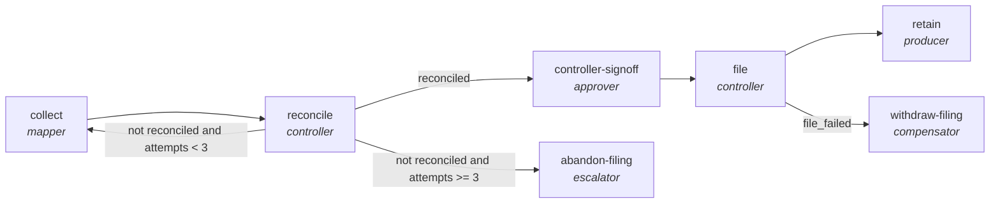

<!-- generated by scripts/gen_traces.py — edit graph.yaml / cases.yaml, then `uv run python scripts/gen_traces.py` -->
# 🔍 Trace gallery · `regulatory-filing-lifecycle`

> Collect figures, reconcile them to source, gate on controller sign-off, then file and retain evidence.

1 golden case(s), 1/1 passing (`mock` runner, provisional).

## The graph

## Cases

### `happy-path` — ✅ passed

**Route** (5 step(s)): `collect` → `reconcile` → `controller-signoff` → `file` → `retain`

| # | Node | Output |
|---|---|---|
| 1 | `collect` | `figures=[]` |
| 2 | `reconcile` | `variance=0, reconciled=True, filing_total=1000, ledger_total=1000, output={}` |
| 3 | `controller-signoff` | `signed_off=True` |
| 4 | `file` | `filed=True, confirmation_id='confirmation_id-value'` |
| 5 | `retain` | `evidence_pack='pack-1', output={'reconciled': True, 'signed_off': True, 'filed': True, 'evidence_pack': 'pack-1', 'filing_total': 1000, 'ledger_total': 1000}, filing_total=1000, ledger_total=1000` |

**Verification checked:**

- ✅ `output.filing_total == output.ledger_total`
- ✅ `output.signed_off == true`
- ✅ `output.evidence_pack is not None`

---
*Regenerate: `uv run python scripts/gen_traces.py` · [Trace gallery index](README.md) · [Graph card](../../graphs/finance/regulatory-filing-lifecycle/CARD.md)*
