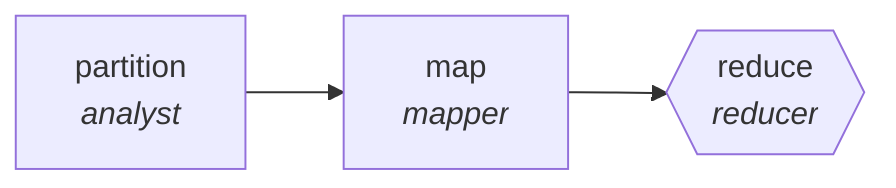

<!-- generated by scripts/gen_traces.py — edit graph.yaml / evals/<name>/cases.yaml, then `uv run python scripts/gen_traces.py` -->
# 🔍 Trace gallery · `release-notes-generation`

> Summarize merged PRs per area, reduce into release notes.

2 golden case(s), 2/2 passing (`mock` runner, provisional).

## The graph

## Cases

### `single-item` — ✅ passed

**Route** (3 step(s)): `partition` → `map` → `reduce`

| # | Node | Output |
|---|---|---|
| 1 | `partition` | `shard_count=1, shards=[{'i': 1}, {'i': 2}, {'i': 3}]` |
| 2 | `map` | `shard_result=[{'id': 1, 'finding': 'ok'}]` |
| 3 | `reduce` | `output={'notes': [{'text': 'fixed login bug', 'pr_url': 'https://github.com/org/repo/pull/1'}], 'orphan_claims': []}` |

**Verification checked:**

- ✅ `all(n.pr_url for n in output.notes) and not output.orphan_claims`

### `multi-item` — ✅ passed

**Route** (3 step(s)): `partition` → `map` → `reduce`

| # | Node | Output |
|---|---|---|
| 1 | `partition` | `shard_count=2, shards=[{'i': 1}, {'i': 2}, {'i': 3}]` |
| 2 | `map` | `shard_result=[{'id': 1, 'finding': 'ok'}]` |
| 3 | `reduce` | `output={'notes': [{'text': 'fixed login bug', 'pr_url': 'https://github.com/org/repo/pull/1'}, {'text': 'improved perf', 'pr_url': 'https://github.com/org/repo/pull/2'}], 'orphan_claims': []}` |

**Verification checked:**

- ✅ `all(n.pr_url for n in output.notes) and not output.orphan_claims`

---
*Regenerate: `uv run python scripts/gen_traces.py` · [Trace gallery index](README.md) · [Graph card](../../graphs/software-engineering/release-notes-generation/CARD.md)*
