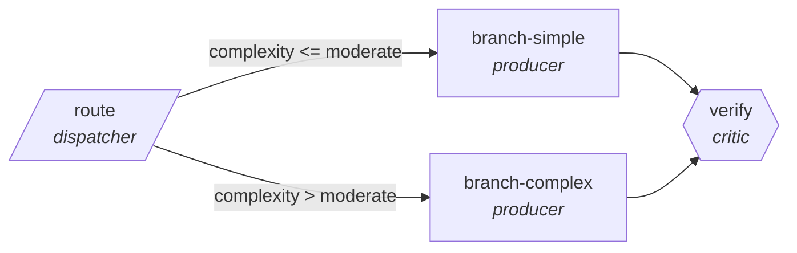

<!-- generated by scripts/gen_traces.py — edit graph.yaml / cases.yaml, then `uv run python scripts/gen_traces.py` -->
# 🔍 Trace gallery · `returns-triage`

> Route returns by reason to refund, repair, or fraud review.

2 golden case(s), 2/2 passing (`mock` runner, provisional).

## The graph

## Cases

### `simple-branch` — ✅ passed

**Route** (3 step(s)): `route` → `branch-simple` → `verify`

| # | Node | Output |
|---|---|---|
| 1 | `route` | `complexity='low'` |
| 2 | `branch-simple` | `assigned_disposition='refund'` |
| 3 | `verify` | `assigned_disposition='refund', expected_disposition='refund', output={'assigned_disposition': 'refund', 'expected_disposition': 'refund'}` |

**Verification checked:**

- ✅ `output.assigned_disposition == output.expected_disposition`
- ✅ `len(output.expected_disposition) > 0`

### `complex-branch` — ✅ passed

**Route** (3 step(s)): `route` → `branch-complex` → `verify`

| # | Node | Output |
|---|---|---|
| 1 | `route` | `complexity='high'` |
| 2 | `branch-complex` | `assigned_disposition='refund'` |
| 3 | `verify` | `assigned_disposition='refund', expected_disposition='refund', output={'assigned_disposition': 'refund', 'expected_disposition': 'refund'}` |

**Verification checked:**

- ✅ `output.assigned_disposition == output.expected_disposition`
- ✅ `len(output.expected_disposition) > 0`

---
*Regenerate: `uv run python scripts/gen_traces.py` · [Trace gallery index](README.md) · [Graph card](../../graphs/logistics-retail/returns-triage/CARD.md)*
