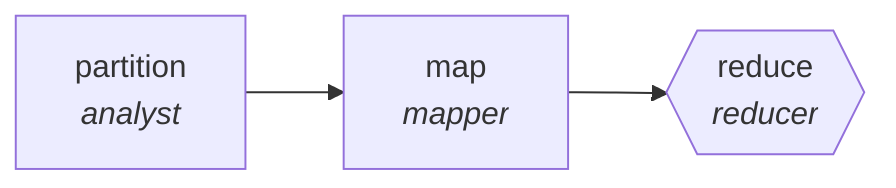

<!-- generated by scripts/gen_traces.py — edit graph.yaml / evals/<name>/cases.yaml, then `uv run python scripts/gen_traces.py` -->
# 🔍 Trace gallery · `rfp-response-assembler`

> Answer each RFP requirement from a knowledge base, assemble.

2 golden case(s), 2/2 passing (`mock` runner, provisional).

## The graph

## Cases

### `single-item` — ✅ passed

**Route** (3 step(s)): `partition` → `map` → `reduce`

| # | Node | Output |
|---|---|---|
| 1 | `partition` | `shard_count=1` |
| 2 | `map` | *(no fixture — empty output)* |
| 3 | `reduce` | `output={'requirements': [{'id': 'R1', 'answered': True, 'flagged': False}, {'id': 'R2', 'answered': False, 'flagged': True}], 'page_count': 8, 'page_limit': 10}` |

**Verification checked:**

- ✅ `all(r.answered or r.flagged for r in output.requirements) and output.page_count <= output.page_limit`

### `multi-item` — ✅ passed

**Route** (3 step(s)): `partition` → `map` → `reduce`

| # | Node | Output |
|---|---|---|
| 1 | `partition` | `shard_count=2` |
| 2 | `map` | *(no fixture — empty output)* |
| 3 | `reduce` | `output={'requirements': [{'id': 'R1', 'answered': True, 'flagged': False}, {'id': 'R2', 'answered': False, 'flagged': True}, {'id': 'R3', 'answered': True, 'flagged': False}], 'page_count': 10, 'page_limit': 10}` |

**Verification checked:**

- ✅ `all(r.answered or r.flagged for r in output.requirements) and output.page_count <= output.page_limit`

---
*Regenerate: `uv run python scripts/gen_traces.py` · [Trace gallery index](README.md) · [Graph card](../../graphs/business-ops/rfp-response-assembler/CARD.md)*
