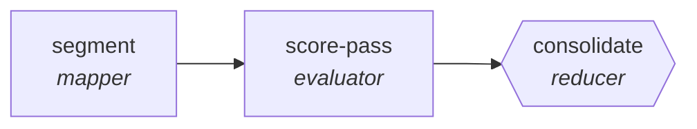

<!-- generated by scripts/gen_traces.py — edit graph.yaml / cases.yaml, then `uv run python scripts/gen_traces.py` -->
# 🔍 Trace gallery · `sales-call-scorer`

> Score a call against a rubric from several independent passes, reporting variance as a confidence signal.

1 golden case(s), 1/1 passing (`mock` runner, provisional).

## The graph

## Cases

### `happy-path` — ✅ passed

**Route** (3 step(s)): `segment` → `score-pass` → `consolidate`

| # | Node | Output |
|---|---|---|
| 1 | `segment` | `segments=[{'s': 1}, {'s': 2}]` |
| 2 | `score-pass` | `rubric_score=7` |
| 3 | `consolidate` | `final_score=78, variance=0.14, output={'segments_scored': 6, 'variance': 0.14, 'final_score': 78}` |

**Verification checked:**

- ✅ `output.segments_scored >= 1`
- ✅ `output.variance is not None`

---
*Regenerate: `uv run python scripts/gen_traces.py` · [Trace gallery index](README.md) · [Graph card](../../graphs/customer-support-sales/sales-call-scorer/CARD.md)*
