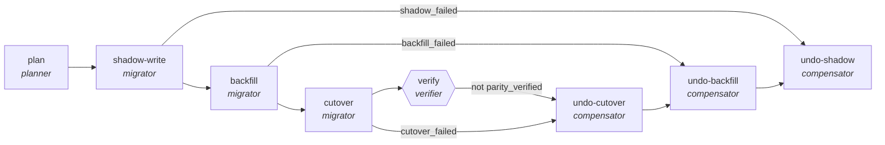

<!-- generated by scripts/gen_traces.py — edit graph.yaml / cases.yaml, then `uv run python scripts/gen_traces.py` -->
# 🔍 Trace gallery · `schema-migration-saga`

> Migrate a schema in four reversible steps; any failure compensates back to a consistent state.

1 golden case(s), 1/1 passing (`mock` runner, provisional).

## The graph

## Cases

### `happy-path` — ✅ passed

**Route** (5 step(s)): `plan` → `shadow-write` → `backfill` → `cutover` → `verify`

| # | Node | Output |
|---|---|---|
| 1 | `plan` | `migration_plan='migration_plan-value'` |
| 2 | `shadow-write` | `shadow_active=True` |
| 3 | `backfill` | `backfill_complete='backfill_complete-value'` |
| 4 | `cutover` | `cutover_done='cutover_done-value', executed_steps=3` |
| 5 | `verify` | `parity_verified=True, output={'parity_verified': True, 'consistent': False}, source_rows=1000, target_rows=1000` |

**Verification checked:**

- ✅ `output.source_rows == output.target_rows or output.compensated_steps == output.executed_steps`
- ⏭️ `alembic upgrade head` — command checks are skipped by the mock runner (run with `--live` against a real environment to exercise them)

---
*Regenerate: `uv run python scripts/gen_traces.py` · [Trace gallery index](README.md) · [Graph card](../../graphs/data-analytics/schema-migration-saga/CARD.md)*
